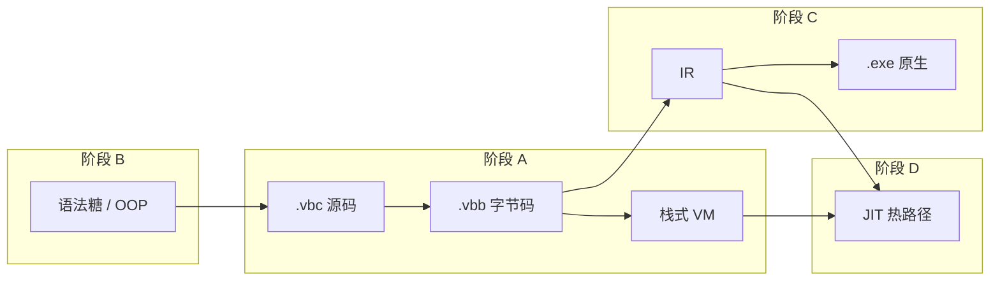

# Verbose-C 功能实现目标清单

本文档描述 **C 语言兼容之外** 的扩展能力与编译器演进目标，涵盖脚本化语法糖、面向对象、字节码产物、原生编译后端与 JIT。C 语言本体兼容项见 [C_COMPATIBILITY_TARGETS.md](./C_COMPATIBILITY_TARGETS.md)。

## 1. 目标边界

- **总目标**：在现有「源码 → 字节码 → 栈式 VM 解释执行」管线基础上，逐步演进为可生成并执行原生二进制的完整编译器。
- **范围**：扩展语法、OOP 语义、字节码持久化与加载、字节码优化、中间表示（IR）、指令选择与寄存器分配、机器码生成、JIT。
- **非目标**（本清单不覆盖）：C17 标准库完整实现、预处理器与 C 类型系统细节（见 C 兼容清单）、IDE/LSP 集成。
- **与 C 兼容清单的关系**：本清单**不重复** C 兼容文档已列项（如显式 `int main()` / `void main()` 的识别、自动调用与退出码通路，见 [C_COMPATIBILITY_TARGETS.md § P1-8](./C_COMPATIBILITY_TARGETS.md)）。两者并行时，入口策略需统一：**有 `main` 定义 → C 兼容 P1-8；无 `main` 定义 → 本文 P1-1 脚本入口语义**。

## 2. 优先级定义

- **P0（必须）**：不完成则无法支撑「解释器 → 编译器」主路径的下一阶段（字节码产物闭环、后端输入稳定）。
- **P1（高优）**：显著影响扩展语言体验或后端开发效率，但不阻断字节码/AOT 最小闭环。
- **P2（增强）**：性能、多目标、高级 OOP/语法糖；建议在 P0/P1 主干稳定后推进。
- **P3（远期）**：JIT、动态去优化、跨平台发布体系等研究型或工程量大项。

---

## 3. P0 目标（必须完成）

### P0-1 字节码二进制格式与序列化闭环

- 目标能力：
  - 【未完成】定义稳定的 `.vbb`（Verbose-C Bytecode）文件格式：魔数、版本号、目标 ABI、常量池、函数表、模块级字节码、行号表、调试元数据
  - 【未完成】常量池支持现有运行时对象的可序列化子集：`int`/`float`/`bool`/`string`/`null`、函数元数据、类元数据（方法字节码嵌套或索引引用）
  - 【未完成】实现 `ArtifactStore.save_bytecode()` / `load_bytecode()`（`verbose_c/fs/artifact_store.py`）
  - 【未完成】实现 `artifact_path_for_source()`：由 `.vbc` 推导默认 `.vbb` 路径（可与输出目录、`-o` 参数配合）
  - 【未完成】格式版本向前兼容策略：读旧版、写新版时给出明确错误或自动迁移说明
- 当前现状：
  - 字节码仅存在于内存：`CompilerOutput.bytecode` 为 `list[tuple[Opcode, ...]]`，`constant_pool` 为 Python 对象列表
  - 函数/方法字节码分散在 `function_compilation_results` 与 `VBCFunction` 运行时对象中，尚无统一打包规范
  - `ArtifactStore` 全部为 `NotImplementedError` 占位
  - CLI 有 `--compile-only`，但无字节码文件输出选项
- 验收标准：
  - 给定 `tests/grammar/functions_test.vbc`，编译后可写出 `.vbb`，再次加载后与内存编译结果字节码等价（逐指令比对或哈希一致）
  - 常量池中字符串、数值、函数引用在加载后可被 VM 正确还原
  - 格式版本不匹配时抛出 `VBCCompileError` 或专用 `VBCBytecodeError`，含文件路径与期望版本
  - 至少 2 类测试：正向（round-trip 编译-保存-加载-执行）、反向（损坏/截断文件、错误魔数）

### P0-2 字节码文件直接读取与执行

- 目标能力：
  - 【未完成】CLI 支持直接运行 `.vbb`：`verbose-c program.vbb` 或显式 `--bytecode` 模式
  - 【未完成】`engine` 层新增 `run_bytecode_file()`：跳过词法/语法/类型检查，直接构造 `VBCVirtualMachine` 并 `excute()`
  - 【未完成】加载路径与源码路径解耦：无源码时仍可运行；有调试信息时可选用 `--source-map` 或内嵌路径做错误回溯
  - 【未完成】`--compile-only` 与字节码输出打通：编译 `.vbc` 默认或可选写出 `.vbb` 后退出
- 当前现状：
  - 执行入口 `run_source_file()` 固定走完整编译管线
  - VM 已支持接收 `bytecode` + `constant_pool` + `lineno_table`（`VBCVirtualMachine.excute`），缺的是持久化加载层
  - `PipelineRecorder` 可将字节码 dump 为 markdown，非可执行二进制格式
- 验收标准：
  - `verbose-c foo.vbb` 执行结果与 `verbose-c foo.vbc` 一致（同一源码 freshly 编译对比）
  - `--compile-only -o foo.vbb foo.vbc` 生成文件后，单独执行 `.vbb` 成功
  - 运行时错误仍能输出 PC、操作码名；若行号表存在，应映射回合理行号
  - 反向：加载非 `.vbb` 或版本不兼容文件时失败并报错

### P0-3 字节码级优化（解释器后端第一步）

- 目标能力：
  - 【未完成】在 `Compiler.compile()` 代码生成之后增加可选 **字节码优化 Pass**（`optimize_level > 0` 时启用）
  - 【未完成】实现基础窥孔优化：冗余 `POP`/`DUP` 消除、连续 `LOAD`/`STORE` 同一槽位合并、死代码删除（不可达标签后指令）
  - 【未完成】常量折叠（栈上两常量算术直接变为 `LOAD_CONSTANT`）
  - 【未完成】跳转链简化：`JUMP` 到 `JUMP` 的目标直连
  - 【未完成】优化后更新 `lineno_table` 与标签地址，保证 VM 行为不变
- 当前现状：
  - `Compiler.__init__` 接受 `optimize_level`，但全项目固定传 `0`，优化 Pass 未实现
  - `compiler.py` 注释 `# TODO 编译完成后的字节码优化`
  - 标签解析在 `OpcodeGenerator` 生成阶段完成，尚无独立优化器模块
- 验收标准：
  - `optimize_level=0` 与优化前行为 bitwise 一致（现有测试全部通过）
  - `optimize_level=1` 对含冗余栈操作的样例可减少指令条数，执行结果不变
  - dump `opcode` 可对比优化前后指令序列
  - 每项优化至少有 1 个正向微应用例

---

## 4. P1 目标（高优先级）

### P1-1 脚本化语法糖：隐式 `main` 入口（无显式 `main` 定义时）

- 目标能力：
  - 【部分完成】入口文件**未定义** `int main()` / `void main()` 时，将可执行顶层代码视为运行在隐式 `main` 内；语义上等价于编译器合成：

    ```c
    int main() {
        // 入口文件中所有顶层可执行语句（含全局变量声明与初始化）
        // 函数/类定义仅完成注册，不自动执行
        return 0;   // 这里虽然写了return，但想表达的实际上是类似于C语言中main的return，也就是将执行结果返回给命令行，实际return应该必须在函数中使用，这里不带返回功能，类似exit(0)
    }
    ```

  - 【未完成】顶层（函数体外）出现 `return` / `return expr;` **必须报编译错误**；`return` 仅用于从函数返回，脚本隐式入口不提供顶层 `return` 语法糖
  - 【部分完成】典型脚本式入口：`tests/stdio_test.vbc` 无 `main`，顶层 `write`/`read` 直接执行即属此模式
  - 【未完成】隐式入口正常结束时，编译器在可执行顶层代码末尾自动注入 `exit(0)`，进程退出码为 `0`（需 `cli` / `engine` / VM 退出码通路闭环）
  - 【未完成】内置函数 `exit(int code)`：在隐式或显式 `main` 内调用可立即终止进程并返回指定退出码（**暂未实现**）
  - 【明确不在此项】显式 `main` 定义时的自动调用、返回值、与顶层语句的执行顺序 — 见 C 兼容 **P1-8**，本文不重复
- 当前现状：
  - 解释器已支持「无 `main` 则顶层顺序执行」，行为接近脚本模式，但**未形式化**为隐式 `main`，也无统一退出码约定
  - `OpcodeGenerator.visit_ModuleNode` 平铺执行模块语句，无入口模式标记
  - 无 `exit()` 内置函数；CLI 不读取 VM 退出码
- 与 C 兼容 P1-8 的分工：

| 条件 | 负责文档 | 行为概要 |
| ---- | -------- | -------- |
| 存在 `int main()` / `void main()` 定义 | C 兼容 P1-8 | 顶层注册 + 自动调用 `main`；`int main` 的 `return` 为退出码 |
| **不存在** `main` 定义 | **本文 P1-1** | 可执行顶层代码等价于隐式 `main` 体；末尾自动 `exit(0)`；`exit(code)` 可提前终止；顶层 `return` 非法 |

- 验收标准：
  - `tests/stdio_test.vbc` 在无修改下可编译运行，I/O 行为与现在一致，正常结束后 shell 退出码为 `0`
  - 隐式入口文件中 `exit(3);` 实现后，进程以退出码 `3` 结束（不必执行到末尾自动注入的 `exit(0)`）
  - 同一文件**不能**既无 `main` 定义又期望 C 兼容 P1-8 的自动 `main` 行为；一旦定义 `main`，仅 P1-8 生效
  - 反向：隐式入口模式下，顶层 `return;` 或 `return expr;` 必须编译失败，并提示 `return` 只能出现在函数内

### P1-2 脚本化语法糖：范围表达式 `Range`

- 目标能力：
  - 【未完成】语法层支持范围字面量或表达式（如 `0..10`、`0..10..2`，具体语法待 grammar 定义）
  - 【未完成】`RangeNode` 接入 parser 与 type checker；定义 `RangeType` 或复用迭代协议
  - 【未完成】`OpcodeGenerator.visit_RangeNode` 实现：生成范围对象或降维为 `for` 循环 desugar
  - 【未完成】`for (int i : range)` 或 `for (i = 0; i < n; i++)` 糖化形式（二选一 MVP）
- 当前现状：
  - AST 已有 `RangeNode`（`verbose_c/parser/parser/ast/node.py`），但 **grammar 未接入**
  - `visit_RangeNode` 直接 `NotImplementedError`
- 验收标准：
  - 范围参与 `for` 循环可正确迭代
  - 步长默认值、空范围、倒序范围（若支持）有明确语义与测试
  - 反向：非法范围表达式报类型或语法错误

### P1-3 脚本化语法糖：关键字参数

- 目标能力：
  - 【未完成】函数定义可选关键字参数：`FunctionNode.kwargs` 从 AST 占位接入 grammar
  - 【未完成】调用语法：`foo(a=1, b=2)`；`CallNode.kwargs` 参与类型检查与代码生成
  - 【未完成】构造函数 `new Foo(x=1)` 支持关键字参数
  - 【未完成】与位置参数混用规则：位置在前、关键字在后；重复参数报错
- 当前现状：
  - `CallNode` / `FunctionNode` 已有 `kwargs` 字段，标注 `# TODO 暂未使用`
  - `visit_CallNode` / `visit_NewInstanceNode` 遇 `kwargs` 即 `NotImplementedError`
- 验收标准：
  - 内置函数与用户自定义函数均可用关键字调用
  - 缺省参数、仅关键字调用场景通过
  - 反向：未知参数名、重复绑定、位置参数在关键字之后 — 编译错误

### P1-4 脚本化语法糖：内置类型与反射增强

- 目标能力：
  - 【部分完成】`true`/`false`/`null` 字面量；`string` 类型
  - 【未完成】`exit(int code)` 内置函数（进程终止与退出码，与 **P1-1** 联调）
  - 【待完善】字符串与数值互操作规则文档化（隐式转换边界与 C 模式切换策略）
  - 【未完成】可选：字符串插值或格式化糖（如 `"%d".format(x)` 或 f-string 风格，语法待定）
- 当前现状：
  - 隐式转换在 `TypeChecker` 与 `OpcodeGenerator._emit_implicit_cast_if_needed` 中部分实现
  - `visit_CastNode` 注释 `# TODO 增加自定义数据类型和类的转换`
- 验收标准：
  - 新糖引入时不破坏现有 `expressions_test.vbc` 等行为

### P1-5 面向对象：核心模型巩固

- 目标能力：
  - 【已完成】`class` 定义、多继承 `extends A, B`、`new`、`成员访问`（`.`）、方法调用
  - 【已完成】`super` 方法调用（`super.get_id()`）；`SUPER_GET` 操作码
  - 【已完成】字段默认 `null`、显式初始化、`__init__` 自动生成（无用户定义时）
  - 【已完成】MRO 计算（`ClassType._compute_mro`）、父类字段/方法合并
  - 【待完善】`super` 语义仅绑定第一个父类（`visit_SuperNode` 取 `super_class[0]`），多继承下需明确规则
  - 【未完成】显式 `this` 关键字（当前方法内隐式 `this` 为局部槽 0）
- 当前现状：
  - `tests/grammar/classes_and_members_test.vbc` 覆盖基本类场景
  - 类对象在编译期写入常量池为 `VBCClass`，方法为 `VBCFunction`
- 验收标准：
  - 多继承方法解析符合 MRO 顺序（钻石继承基础场景有测试）
  - `super` 在多层继承链上调用正确父类实现
  - 反向：类重复定义、继承未定义类、在非方法内使用 `super` 报错

### P1-6 面向对象：访问控制与静态成员

- 目标能力：
  - 【未完成】`public` / `private`（或 `protected`）修饰类字段与方法
  - 【未完成】`static` 字段与 `static` 方法：属于类而非实例
  - 【未完成】语义层禁止类外访问 `private` 成员；同一类/友元规则（MVP 可仅做类内+同类实例）
- 当前现状：
  - 所有成员均为公开；无修饰符 grammar
- 验收标准：
  - 类外访问 `private` 字段/方法编译失败
  - `static` 方法可通过 `ClassName.method()` 调用，无需实例
  - 静态与实例成员 shadowing 规则有测试

### P1-7 面向对象：构造、析构与类型转换

- 目标能力：
  - 【部分完成】用户定义 `__init__` 与用户字段初始化语句合并进合成构造逻辑
  - 【未完成】父类 `__init__` 链式调用（`super.__init__(...)` 或自动默认）
  - 【未完成】析构函数 `__del__` 或 `~ClassName()` 与 GC 协作（确定性与 GC 触发时机需文档化）
  - 【未完成】类实例向上/向下转型（`TypeChecker` 规则 7 待实现）、与 `CastNode` 打通
- 当前现状：
  - `type_checker_visitor`：`# TODO 规则 7: 允许对象类型之间的向上和向下转型`
- 验收标准：
  - 子类实例可赋给父类类型变量（向上转型）
  - 向下转型失败时运行时或编译期报错（策略需明确）
  - 构造链在多层继承下字段初始化顺序正确

### P1-8 增量编译与依赖追踪

- 目标能力：
  - 【未完成】实现 `IncrementalCompiler`（`verbose_c/fs/incremental_compile.py`）
  - 【未完成】记录 `#include` 依赖边；源文件或头文件变更时 `needs_recompile()` 为真
  - 【未完成】与 `.vbb` 产物时间戳或内容哈希联动
  - 【未完成】依赖图持久化（侧车 `.vbc.deps.json` 或写入 `.vbb` 元数据）
- 当前现状：
  - 全部为 `NotImplementedError` 占位
  - 预处理器已有 `_included_files` 去重，但未暴露给增量层
- 验收标准：
  - 修改被 include 的头文件后，再次编译入口文件会触发重编译
  - 未变更时跳过编译，直接加载 `.vbb`（与 P0-2 联调）
  - `invalidate(path)` 可使缓存失效

---

## 5. P2 目标（增强项：原生编译后端）

> 后端管线目标形态：**字节码（+ 元数据）→ 提升（Lower）→ IR → 优化 → 指令选择 → 寄存器分配 → 目标机器码 → 可执行文件**。

### P2-1 中间表示（IR）设计与字节码下降

- 目标能力：
  - 【未完成】定义语言无关或轻目标绑定的 IR（建议 SSA 或三地址码，含基本块、CFG、φ 节点）
  - 【未完成】新增 `CompilerPass.LOWER_TO_IR`：自 stack bytecode 做栈到寄存器/三地址的提升（stack slot → virtual register）
  - 【未完成】IR 保留类型信息与源码映射（debug line table）
  - 【未完成】IR 文本或 Graphviz dump 供 `--dump ir` 调试
- 当前现状：
  - 无 IR 模块；`CompilerPass` 仅有 `TYPE_CHECK`、`GENERATE_CODE`
  - 项目架构图（`docs/PROJECT_RELATIONSHIP.mmd`）在 Compiler 层止于 `OpcodeGenerator`
- 验收标准：
  - 简单算术函数 `int add(int a,int b)` 可下降为 IR，基本块结构正确
  - IR dump 可对照源码行号
  - 下降过程对不支持的 opcode 给出明确列表（用于迭代补齐）

### P2-2 IR 级优化

- 目标能力：
  - 【未完成】常量传播、死代码消除、公共子表达式消除（局部）
  - 【未完成】内联候选识别（小函数、无递归）
  - 【未完成】循环不变量外提（可选）
  - 【未完成】优化 Pass 可配置级别，与 P0-3 字节码优化分工明确（字节码窥孔 vs IR 全局）
- 当前现状：
  - 未开始
- 验收标准：
  - 优化前后 IR 语义等价（可用解释执行 IR 的参考解释器或转回字节码比对）
  - 典型循环计数样例指令数减少

### P2-3 指令选择与目标描述

- 目标能力：
  - 【未完成】选定首个目标平台 MVP：**x86-64 Windows**（与当前开发环境一致）
  - 【未完成】定义目标指令描述（TdG 或手工表）：IR 操作 → 汇编助记符模式
  - 【未完成】调用约定：与现有 VM 栈式约定不同的 **System V AMD64**（或 Windows x64）ABI 文档
  - 【未完成】内建运行时桥：GC 安全点、分配 helper、异常/陷阱（可先简化无 GC 的 AOT 子集）
- 当前现状：
  - 无目标后端目录；运行时对象依赖 Python GC 与 `VBCObject` 体系
- 验收标准：
  - 不含 OOP/GC 的纯 `int` 算术函数可生成合法 `.asm` 或机器码 blob
  - 外部 C 编译器可链接生成的目标文件（若采用 .o 输出）

### P2-4 寄存器分配

- 目标能力：
  - 【未完成】虚拟寄存器 → 物理寄存器（线性扫描或图着色）
  - 【未完成】溢出槽（stack slots）布局与调用约定保存寄存器集合
  - 【未完成】phi 消解（若 IR 为 SSA）
- 当前现状：
  - 未开始；栈式 VM 无寄存器概念
- 验收标准：
  - 寄存器压力大的函数（多局部变量、嵌套表达式）生成代码可正确运行
  - 分配结果可 dump（虚拟 reg → 物理 reg / spill offset）

### P2-5 机器码生成与可执行文件输出

- 目标能力：
  - 【未完成】汇编文本输出（`.asm`）或直接机器码（`.o` / `.obj`）
  - 【未完成】链接步骤：生成 CRT 程序入口（对接 C 兼容 P1-8 或本文 P1-1 的入口约定）、链接最小运行时（`libvbcrt`：启动、堆、可选 GC）
  - 【未完成】CLI：`verbose-c -o app.exe foo.vbc` 或 `foo.vbb` → 原生可执行文件
  - 【未完成】与字节码模式共存：同一前端，后端选择 `--target=vm|native`
- 当前现状：
  - 未开始
- 验收标准：
  - `hello world` 级原生程序独立运行，不依赖 Python 解释 VM
  - 进程退出码与入口约定一致（显式 `main` 见 C 兼容 P1-8；隐式入口见本文 P1-1）
  - 反向：不支持的语义（如动态类加载）在 `-target=native` 时报编译错误而非静默错误

### P2-6 运行时分离（AOT 版 libvbcrt）

- 目标能力：
  - 【未完成】将 `VBCVirtualMachine` 中的对象模型、内存管理、GC、内置函数抽离为可链接的 C/C++ 或 Rust 运行时
  - 【未完成】定义 VM opcode 与 native 调用的边界：哪些走内联快速路径，哪些必须 runtime call
  - 【未完成】GC 安全点、栈图（stack map）供精确回收
- 当前现状：
  - 全部逻辑在 Python `verbose_c/vm`、`verbose_c/object`
- 验收标准：
  - AOT 程序可分配对象、调用 `write` 等最小内置函数
  - 文档说明 native 运行时与 Python VM 的行为差异表

### P2-7 数组切片语法糖（Python 风格 `[start:end:step]`）

> 依赖 C 兼容 [P0-7](./C_COMPATIBILITY_TARGETS.md) 数组闭环；与 C17 标准下标 `arr[i]` 并存，**冲突时以 C17 语义为准**。

- 目标边界：
  - 仅当 `[` `]` 内出现 `:` 时启用切片语法；纯表达式下标 `arr[i]`、`arr[i + j]` 始终走 C17 路径
  - 不修改 C17 数组类型、衰变、初始化等既有语义
  - 切片为 Verbose-C 扩展，合法 C17 源码不应因本特性产生行为变化
- 目标能力：
  - 【未完成】支持 `arr[start:end]`、`arr[start:end:step]` 及省略界形式（如 `arr[:]`、`arr[::2]`）
  - 【未完成】`start` / `end` / `step` 均为可选整型表达式；负索引语义文档化（若支持）
  - 【未完成】切片结果类型与存储策略明确（MVP 可返回新数组副本，视图语义为后续增强）
- 当前现状：
  - 【未完成】未开始；C 数组（P0-7）尚未实现
- 与 C17 的冲突处理原则：

| 场景 | C17 语义 | 本扩展 |
| ---- | -------- | ------ |
| `arr[i]` | 下标访问 | **同左**，不启用切片 |
| `arr[1:3]` | 非法语法 | 切片（扩展） |
| `arr[i:j]`（`i`,`j` 为变量） | 非法 | 切片（扩展） |
| 多维 `m[i][j]` | 嵌套下标 | **同左**；多维切片 `[i:j]` 为后续可选 |

- 验收标准：
  - `int a[10];` 已实现时，`a[2:5]`、`a[::2]` 可编译运行且结果符合文档
  - `a[0]`、`a[i + 1]` 与 C17 行为一致，回归用例在开启切片特性前后结果不变
  - 反向：`step = 0`、对非数组切片、切片界类型错误 — 编译失败并给出明确中文错误

---

## 6. P3 目标（远期：JIT 即时编译）

### P3-1 分层编译策略

- 目标能力：
  - 【未完成】定义 **Tier 0**：字节码解释（现有 VM）
  - 【未完成】定义 **Tier 1**：热点函数 JIT 至机器码（baseline compiler，快速生成）
  - 【未完成】定义 **Tier 2**（可选）：优化 JIT 或去优化回退至解释器
  - 【未完成】热点计数：基于函数调用次数或回边（back-edge）计数
- 当前现状：
  - 仅 Tier 0；`VBCVirtualMachine` 主循环解释执行
- 验收标准：
  - 可配置阈值，超过后函数体执行路径切换为机器码
  - 去优化后行为与纯解释一致

### P3-2 JIT 代码缓存与可执行内存

- 目标能力：
  - 【未完成】按平台分配 RWX/RX 内存页（Windows `VirtualAlloc` 等）
  - 【未完成】JIT 桩（trampoline）：解释器 `CALL_FUNCTION` 可跳转到 JIT 入口
  - 【未完成】代码缓存失效：源码/字节码变更时丢弃旧 JIT 块
- 当前现状：
  - 未开始
- 验收标准：
  - 同一函数第二次热调用走 JIT 路径，结果正确
  - 内存泄漏检测：反复 JIT/失效不无限增长（压力测试）

### P3-3 去优化与调试

- 目标能力：
  - 【未完成】守卫（guard）：类型假设失败时去优化
  - 【未完成】JIT 帧与 `TracebackFrame` 衔接，错误栈可混合显示 JIT/解释帧
  - 【未完成】`--jit=off|baseline|opt` CLI 开关
- 当前现状：
  - 未开始
- 验收标准：
  - 故意触发类型去优化后程序仍正确
  - 运行时错误栈可读

### P3-4 OSR（栈上替换，可选）

- 目标能力：
  - 【未完成】长循环中途进入 JIT（On-Stack Replacement）
- 当前现状：
  - 未开始
- 验收标准：
  - 大循环场景相对纯解释有可测加速（基准脚本，不强制具体倍率）

---

## 7. 明确降级（暂不进入本清单主线）

- 完整 C++ 风格模板、异常 `try/catch`、协程
- 多线程/memory model
- 跨平台 AOT（ARM、macOS、Linux）在 x64 Windows MVP 之前
- LLVM 后端集成（可作为 P2 的替代路线调研，非近期承诺）
- 嵌入式/WASM 目标
- 数组切片 `[start:end:step]`（见 **P2-7**；依赖 C 兼容 P0-7，非 C17 本体）

---

## 8. 实施顺序建议（编译器演进路线）

### 阶段 A：字节码产物闭环（解释器仍为主执行引擎）

- 完成 **P0-1 → P0-2 → P0-3**
- 打通 `vbc → vbb → vm` 与 `--compile-only`
- 可并行启动 **P1-8**（增量编译）依赖追踪设计

### 阶段 B：扩展语言体验

- 推进 **P1-1**（隐式脚本入口 + `exit`）、**P1-2**、**P1-3**
- 巩固 **P1-5 → P1-7** OOP 语义
- C 兼容 P0-7 数组完成后，可择机启动 **P2-7** 切片语法糖（长期，不阻塞 C 主线）

### 阶段 C：后端基础设施

- **P2-1 IR** → **P2-2 IR 优化** → **P2-3 指令选择** → **P2-4 寄存器分配** → **P2-5 机器码与链接**
- 与 **P2-6 运行时分离** 穿插进行（先无 GC 算术子集，再扩展对象）

### 阶段 D：性能与动态编译

- **P3-1 → P3-3** JIT 最小闭环；**P3-4** 视需求可选
- JIT 复用 P2 的指令选择与寄存器分配组件

### 依赖关系示意



---

## 9. 统一验收原则

- 每个目标至少包含：
  - **语法层**（若适用）：grammar / AST 可解析
  - **语义层**：类型检查、作用域、约束正确
  - **代码生成层**：字节码、IR 或机器码符合规范
  - **运行时验证**：执行结果正确
- 每项至少 2 类测试：
  - 正向样例（应通过）
  - 反向样例（应报错或定义明确行为）
- 字节码格式或 ABI 变更必须 bump 版本号并更新 round-trip 测试
- 错误信息应包含：文件、行号（或 IR/PC）、核心原因

---

## 10. 完成判定（Definition of Done）

一个目标项可标记「完成」，必须同时满足：

- 相关管线层级已闭环（例如 P0 项需 **序列化 + 加载 + VM 执行** 全通）
- 有对应回归测试用例（`tests/` 下正向 + 反向）
- 若影响用户可见行为，更新 README 或语法说明（不要求重复 C 兼容文档内容）
- 不引入现有解释执行能力回退
- 入口与退出码：显式 `main` 以 C 兼容 P1-8 为准；无 `main` 以本文 P1-1 为准；两者实现后不得互相覆盖或冲突

---

## 11. 当前基线快照（2026-07-01）

| 能力域 | 状态 | 关键模块 |
| ------ | ---- | -------- |
| 栈式字节码 VM | 【已完成】 | `verbose_c/vm/core.py`、`Opcode` |
| 源码 → 字节码编译 | 【已完成】 | `Compiler`、`OpcodeGenerator` |
| 类 / 继承 / new / super | 【部分完成】 | `opcode_generator_visitor`、`VBCClass` |
| 隐式 `main` 脚本入口（无 `main` 定义） | 【部分完成】 | 顶层顺序执行已有，未形式化/无 `exit` |
| 显式 `main` 自动调用与退出码 | 【见 C 兼容 P1-8】 | 不在本文重复 |
| Range / 关键字参数 | 【未实现】 | AST 占位，generator 抛 `NotImplementedError` |
| 数组切片 `[start:end:step]` | 【未实现，见 P2-7】 | 依赖 C 兼容 P0-7 |
| `exit()` 内置函数 | 【未实现】 | — |
| 字节码文件 .vbb | 【未实现】 | `ArtifactStore` 占位 |
| 增量编译 | 【未实现】 | `IncrementalCompiler` 占位 |
| 字节码优化 | 【未实现】 | `optimize_level` 未使用 |
| IR / 机器码 / AOT | 【未实现】 | 无后端目录 |
| JIT | 【未实现】 | 无 |
