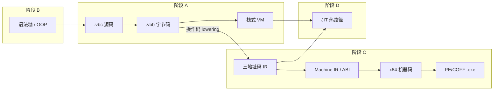

# Verbose-C 功能实现目标清单

本文档描述 **C 语言兼容之外** 的扩展能力与编译器演进目标，涵盖脚本化语法糖、面向对象、字节码产物、原生编译后端与 JIT。C 语言本体兼容项见 [C_COMPATIBILITY_TARGETS.md](./C_COMPATIBILITY_TARGETS.md)。

## 优化、编译与 JIT 主线实现路径

与优化、编译、JIT 相关的目标编号及推荐顺序（不含 P1-1～P1-7 语法糖/OOP、P2-6 数组切片）：

```
1.  F-P0-1  .vbb 格式与序列化          【已完成】稳定字节码产物
2.  F-P0-2  .vbb 直接加载执行          【已完成】跳过前端直接运行
3.  F-P0-3  O1 字节码级优化            【已完成】基础窥孔优化、常量折叠、常量传播、拷贝传播、简单分支优化、语句级 CSE 与简单内联
4.  F-P1-8  增量编译与依赖追踪         【已完成】源未变时复用 .vbb
5.  F-P2-1  IR 与控制流图              【已完成】操作码 lowering 到三地址码 IR / CFG
6.  F-P2-2  O2/O3 优化等级             【未完成】IR/CFG 层高级优化
7.  F-P2-3  Native 后端设计与目标 ABI   【已完成】目标平台、调用约定、机器级 IR
8.  F-P2-4  x64 机器码后端 MVP          【已完成】源码/字节码到 x64 机器码、Windows x64 内存执行与完整返回值观测的 MVP 闭环已跑通
9.  F-P2-5  PE/COFF 可执行文件与运行时   【未完成】机器码 → 独立 exe
10. F-P3-2  热点识别与 JIT 报告         【未完成】统计热点，不生成机器码
11. F-P3-3  JIT 代码缓存与可执行内存    【未完成】trampoline 与代码页
12. F-P3-4  受限整数热循环 JIT MVP      【未完成】首版 JIT 执行
13. F-P3-5  去优化与调试               【未完成】guard 回退与错误栈
14. F-P3-6  OSR 栈上替换               【未完成】长循环中途切入 JIT，可选
```

跨文档前置：F-P1-8 依赖 C-P1-6；F-P2-3 依赖 C-P1-8；F-P2-5 依赖 C-P1-5；F-P3-5 依赖 C-P1-7。

---


## 1. 目标边界

- **总目标**：在现有「源码 → 字节码 → 栈式 VM 解释执行」管线基础上，逐步演进为可生成并执行原生二进制的完整编译器。
- **范围**：扩展语法、OOP 语义、字节码持久化与加载、字节码优化、中间表示（IR）、指令选择与寄存器分配、机器码生成、JIT。
- **非目标**（本清单不覆盖）：C17 标准库完整实现、预处理器与 C 类型系统细节（见 C 兼容清单）、IDE/LSP 集成。
- **与 C 兼容清单的关系**：本清单**不重复** C 兼容文档已列项（如显式 `int main()` / `void main()` 的识别、自动调用与退出码通路，见 [C_COMPATIBILITY_TARGETS.md § P1-8](./C_COMPATIBILITY_TARGETS.md)）。两者并行时，入口策略需统一：**有** `main` **定义 → C 兼容 P1-8；无** `main` **定义 → 本文 P1-1 脚本入口语义**。


## 2. 优先级定义

- **P0（必须）**：不完成则无法支撑「解释器 → 编译器」主路径的下一阶段（字节码产物闭环、后端输入稳定）。
- **P1（高优）**：显著影响扩展语言体验或后端开发效率，但不阻断字节码/AOT 最小闭环。
- **P2（增强）**：性能、多目标、高级 OOP/语法糖；建议在 P0/P1 主干稳定后推进。
- **P3（远期）**：JIT、动态去优化、跨平台发布体系等研究型或工程量大项。

---


## 3. P0 目标（必须完成）


### P0-1 字节码二进制格式与序列化闭环

- 目标能力：
  - 【已完成】定义稳定的 `.vbb`（Verbose-C Bytecode）紧凑二进制格式：魔数、版本号、目标 ABI、常量池、函数表、类表、结构体表、模块级字节码、行号表、调试元数据（详见 [VBB_FORMAT.md](./VBB_FORMAT.md)）
  - 【已完成】常量池支持现有运行时对象的可序列化子集：`int`/`float`/`bool`/`string`/`null`、函数元数据、类元数据（方法字节码通过索引引用）、结构体布局；`VBCPointer`/`VBCInstance`/`VBCNativeFunction` 暂不支持
  - 【已完成】实现 `ArtifactStore.save_bytecode()` / `load_bytecode()`（`verbose_c/fs/artifact_store.py`）
  - 【已完成】实现 `artifact_path_for_source()`：由 `.vbc` 推导默认 `.vbb` 路径为 `<源目录>/__vbccache__/<stem>.vbb`，可与 `-o/--output` 配合
  - 【待完善】格式版本策略：版本不匹配、魔数错误、截断、section checksum/SHA 失败时抛出 `VBCBytecodeError`（含文件路径）；当前仅定义 version 1，不提供旧版 JSON 载荷或跨版本自动迁移
- 当前现状：
  - `ArtifactStore` 已实现紧凑二进制读写，section 化打包函数/类/常量池/字节码块/行号表/调试信息
  - 编译 `.vbc` 时始终写出 `.vbb`（`run_source_file()` 在编译成功后调用 `save_bytecode()`）
  - CLI 支持 `-o/--output` 指定产物路径；未指定时写入 `__vbccache__`
  - 回归测试：`tests/test_artifact_store.py`（round-trip、损坏文件、section 校验）、`tests/test_cli_bytecode.py`（默认缓存目录与 `-o` 输出）
- 验收标准：
  - 给定 `tests/grammar/functions_test.vbc`，编译后可写出 `.vbb`，再次加载后与内存编译结果字节码等价（逐指令比对或哈希一致）
  - 常量池中字符串、数值、函数引用在加载后可被 VM 正确还原
  - 格式版本不匹配时抛出 `VBCCompileError` 或专用 `VBCBytecodeError`，含文件路径与期望版本
  - 至少 2 类测试：正向（round-trip 编译-保存-加载-执行）、反向（损坏/截断文件、错误魔数）


### 【依赖 F-P0-1】P0-2 字节码文件直接读取与执行

- 目标能力：
  - 【已完成】CLI 支持直接运行 `.vbb`：输入文件后缀为 `.vbb` 时走字节码加载执行（无需 `--bytecode` 显式模式）
  - 【已完成】`engine` 层新增 `run_bytecode_file()`：跳过词法/语法/类型检查，直接构造 `VBCVirtualMachine` 并 `excute()`
  - 【待完善】加载路径与源码路径解耦：`.vbb` 内嵌 `source_path`，加载后若源文件仍存在则用于运行时错误回溯；尚无 `--source-map` 参数，无源码时仍可运行
  - 【已完成】`--compile-only` 与字节码输出打通：编译 `.vbc` 始终写出 `.vbb`；`--compile-only` 只控制是否执行，不控制是否生成产物
- 当前现状：
  - `run_source_file()` 编译成功后保存 `.vbb`，可选执行内存编译结果
  - `run_bytecode_file()` 通过 `ArtifactStore.load_bytecode()` 恢复字节码与常量池后执行
  - CLI 已支持 `-o/--output`、`.vbb` 输入分支；`.vbb` 输入不支持 `-o` 与 `--compile-only`
  - 回归测试：`tests/test_cli_bytecode.py` 覆盖 `.vbc → .vbb → 执行` 闭环
- 验收标准：
  - `verbose-c foo.vbb` 执行结果与 `verbose-c foo.vbc` 一致（同一源码 freshly 编译对比）
  - `--compile-only -o foo.vbb foo.vbc` 生成文件后，单独执行 `.vbb` 成功
  - 运行时错误仍能输出 PC、操作码名；若行号表存在，应映射回合理行号
  - 反向：加载非 `.vbb` 或版本不兼容文件时失败并报错


### P0-3 字节码级优化（解释器后端第一步）

- 目标能力：
  - 【已完成】定义优化等级：`O0` 保持现有行为；`O1` 启用不改变语义的解释器后端优化；后续若优化边界扩大到跨基本块或全局语义级分析，归入 P2-2 的 `O2/O3`
  - 【已完成】在 `Compiler.compile()` 中接入 O1 优化管线：类型检查后执行可选 **typed AST 常量优化 Pass**，代码生成和标签解析后执行现有 **字节码优化 Pass**（`optimize_level > 0` 时启用）
  - 【已完成】实现基础窥孔优化：删除 `NOP`、删除不可达指令、删除无意义跳转、合并跳转链；已补齐专门单元测试与 dump 统计
  - 【已完成】优化后更新 `lineno_table` 与跳转目标，保证 VM 行为和错误定位不变；新增优化项保持源码行号和错误定位合理
  - 【已完成】CLI 支持 `-O0` / `-O1`，并可通过 `--dump optimize` 输出 AST 优化摘要与优化后字节码；当前暂不提供 `--optimize`
  - 【已完成】常量折叠：编译期能计算出结果的表达式直接在 typed AST 优化阶段求值，并替换为内部 `ConstantValueNode`，代码生成阶段降为 `LOAD_CONSTANT`
  - 【已完成】常量传播：如果编译器能保守推导出某个变量在使用点的值是常量，则将该使用点替换为 `ConstantValueNode`；遇到重新赋值、函数调用、间接写入、分支/循环等边界时保守停止传播
  - 【已完成】拷贝传播：如果一个变量只是另一个变量的拷贝，则在可证明安全的使用点改写为原变量；首版只替换使用点，不删除中间变量声明、赋值或局部槽位
  - 【已完成】简单分支优化：typed AST 优化阶段已支持 `if` 恒定条件分支裁剪、无副作用条件下的等价 then/else 分支合并、`while(false)` 删除，以及 `for(init; false; update)` 保留初始化并删除循环体和 update
  - 【已完成】公共子表达式消除：typed AST 优化阶段已支持语句级保守 CSE，对同一语句内重复出现的纯复合表达式插入编译器临时变量并复用；跨语句、跨基本块、数组/字段/指针/调用等复杂场景仍保守跳过
  - 【已完成】简单内联：typed AST 优化阶段已支持非常小、调用关系简单且无递归的单 return 纯函数内联；保留实参隐式转换边界，遇到副作用实参、递归、复杂函数体或不安全表达式时保守跳过；这是优化行为，与后续 `inline` 关键词语义保持独立
- 当前现状：
  - `Compiler.__init__` 接受 `optimize_level`，CLI 与 engine 已传递到模块、函数、方法和构造函数编译
  - `verbose_c/compiler/ast_optimizer.py` 提供 O1 typed AST 优化 Pass，当前覆盖字面量、enum 成员、一元/二元常量表达式折叠，保守的过程内常量传播，只替换使用点的拷贝传播，简单分支优化，语句级公共子表达式消除，以及简单内联
  - `ConstantValueNode` 作为优化器内部 AST 节点承载已求值的 `VBCInteger` / `VBCFloat` / `VBCBool` / `VBCString` / `VBCNull`，`OpcodeGenerator.visit_ConstantValueNode` 直接生成 `LOAD_CONSTANT`
  - `verbose_c/compiler/bytecode_optimizer.py` 提供独立 O1 字节码优化 Pass
  - 标签解析在 `OpcodeGenerator.resolve_labels()` 中统一完成，优化器模块只处理已解析的整数 PC 目标
  - 当前 O1 已覆盖控制流清理、常量折叠、常量传播、拷贝传播、简单分支优化、语句级 CSE 和简单内联
  - `PipelineRecorder` 的 `--dump optimize` 已输出 AST 优化摘要（折叠次数、常量传播次数、拷贝传播次数、分支优化次数、公共子表达式消除次数、简单内联次数、跳过原因）和字节码优化摘要（删除 NOP、删除不可达指令、删除无意义跳转、合并跳转链、优化轮次）以及优化后字节码
- 验收标准：
  - `optimize_level=0` 与优化前行为 bitwise 一致（现有测试全部通过）
  - `optimize_level=1` 对含无意义跳转、不可达指令或 `NOP` 的样例可减少指令条数，执行结果不变
  - 【已完成】常量折叠与常量传播提供 `tests/test_ast_optimizer.py` 单元测试和 `tests/grammar/o1_constant_optimization_test.vbc` 集成样例，`-O0` 与 `-O1` 执行结果一致
  - 【已完成】拷贝传播提供 `tests/test_ast_optimizer.py` 单元测试和 `tests/grammar/o1_copy_propagation_test.vbc` 集成样例，`-O0` 与 `-O1` 执行结果一致
  - 【已完成】简单分支优化已提供 `tests/test_ast_optimizer.py` 单元测试和 `tests/grammar/o1_branch_optimization_test.vbc` 集成样例，覆盖恒定条件裁剪、等价分支合并和恒 false 循环删除，`-O0` 与 `-O1` 执行结果一致
  - 【已完成】公共子表达式消除已提供 `tests/test_ast_optimizer.py` 单元测试和 `tests/grammar/o1_cse_test.vbc` 集成样例，覆盖重复返回表达式、变量初始化表达式、三次重复表达式和副作用跳过场景，`-O0` 与 `-O1` 执行结果一致
  - 【已完成】简单内联已提供 `tests/test_ast_optimizer.py` 单元测试和 `tests/grammar/o1_inline_test.vbc` 集成样例，覆盖小函数内联、隐式 cast 保留、副作用实参跳过和递归跳过，`-O0` 与 `-O1` 执行结果一致
  - 对含副作用表达式、变量重新赋值、函数调用、指针/数组/结构体读写、递归调用和复杂控制流的场景，优化器必须保守跳过或给出明确诊断，不得改变程序语义
  - dump `optimize` 可查看 AST 优化摘要和优化后的指令序列，且行号表仍能映射到合理源码行；dump `opcode` 保持原字节码视图
  - 每类字节码优化至少有 1 个正向用例和 1 个保持语义不变的回归用例

---


## 4. P1 目标（高优先级）


### 【依赖 C-P1-5】【依赖 C-P1-8】P1-1 脚本化语法糖：隐式 `main` 入口（无显式 `main` 定义时）

- 目标能力：
  - 【部分完成】入口文件**未定义** `int main()` / `void main()` 时，将可执行顶层代码视为运行在隐式 `main` 内；语义上等价于编译器合成：
    ```c
    int main() {
        // 入口文件中所有顶层可执行语句（含全局变量声明与初始化）
        // 函数/类定义仅完成注册，不自动执行
        return 0;   // 这里虽然写了return，但想表达的实际上是类似于C语言中main的return，也就是将执行结果返回给命令行，实际return应该必须在函数中使用，这里不带返回功能，类似exit(0)
    }
    ```
  - 【未完成】顶层（函数体外）出现 `return` / `return expr;` **必须报编译错误**；`return` 仅用于从函数返回，脚本隐式入口不提供顶层 `return` 语法糖
  - 【部分完成】典型脚本式入口：`tests/stdio_test.vbc` 无 `main`，顶层 `write`/`read` 直接执行即属此模式
  - 【未完成】隐式入口正常结束时，编译器在可执行顶层代码末尾自动注入 `exit(0)`，进程退出码为 `0`（需 `cli` / `engine` / VM 退出码通路闭环）
  - 【部分完成】内置函数 `exit(int code)`：在隐式或显式 `main` 内调用可立即终止 VM 进程并返回指定退出码；native 调试路径中作为 `_exit(int)` 的公开别名走同一受限退出传播机制
  - 【明确不在此项】显式 `main` 定义时的自动调用、返回值、与顶层语句的执行顺序 — 见 C 兼容 **P1-8**，本文不重复
- 当前现状：
  - 解释器已支持「无 `main` 则顶层顺序执行」，行为接近脚本模式，但**未形式化**为隐式 `main`，也无统一退出码约定
  - `OpcodeGenerator.visit_ModuleNode` 平铺执行模块语句，无入口模式标记
  - `exit(int)` 已作为 `_exit(int)` 的公开别名注册；CLI 已读取 VM 退出码
- 与 C 兼容 P1-8 的分工：


| 条件                                 | 负责文档        | 行为概要                                                                   |
| ---------------------------------- | ----------- | ---------------------------------------------------------------------- |
| 存在 `int main()` / `void main()` 定义 | C 兼容 P1-8   | 顶层注册 + 自动调用 `main`；`int main` 的 `return` 为退出码                          |
| **不存在** `main` 定义                  | **本文 P1-1** | 可执行顶层代码等价于隐式 `main` 体；末尾自动 `exit(0)`；`exit(code)` 可提前终止；顶层 `return` 非法 |


- 验收标准：
  - `tests/stdio_test.vbc` 在无修改下可编译运行，I/O 行为与现在一致，正常结束后 shell 退出码为 `0`
  - 【已完成】隐式入口文件中 `exit(3);` 实现后，进程以退出码 `3` 结束（不必执行到末尾自动注入的 `exit(0)`）
  - 同一文件**不能**既无 `main` 定义又期望 C 兼容 P1-8 的自动 `main` 行为；一旦定义 `main`，仅 P1-8 生效
  - 反向：隐式入口模式下，顶层 `return;` 或 `return expr;` 必须编译失败，并提示 `return` 只能出现在函数内


### P1-2 脚本化语法糖：范围表达式 `Range`

- 目标能力：
  - 【未完成】语法层支持范围字面量或表达式（如 `0..10`、`0..10..2`，具体语法待 grammar 定义）
  - 【未完成】`RangeNode` 接入 parser 与 type checker；定义 `RangeType` 或复用迭代协议
  - 【未完成】`OpcodeGenerator.visit_RangeNode` 实现：生成范围对象或降维为 `for` 循环 desugar
  - 【未完成】`for (int i : range)` 或 `for (i = 0; i < n; i++)` 糖化形式（二选一 MVP）
- 当前现状：
  - AST 已有 `RangeNode`（`verbose_c/parser/parser/ast/node.py`），但 **grammar 未接入**
  - `visit_RangeNode` 直接 `NotImplementedError`
- 验收标准：
  - 范围参与 `for` 循环可正确迭代
  - 步长默认值、空范围、倒序范围（若支持）有明确语义与测试
  - 反向：非法范围表达式报类型或语法错误


### P1-3 脚本化语法糖：关键字参数

- 目标能力：
  - 【未完成】函数定义可选关键字参数：`FunctionNode.kwargs` 从 AST 占位接入 grammar
  - 【未完成】调用语法：`foo(a=1, b=2)`；`CallNode.kwargs` 参与类型检查与代码生成
  - 【未完成】构造函数 `new Foo(x=1)` 支持关键字参数
  - 【未完成】与位置参数混用规则：位置在前、关键字在后；重复参数报错
- 当前现状：
  - `CallNode` / `FunctionNode` 已有 `kwargs` 字段，标注 `# TODO 暂未使用`
  - `visit_CallNode` / `visit_NewInstanceNode` 遇 `kwargs` 即 `NotImplementedError`
- 验收标准：
  - 内置函数与用户自定义函数均可用关键字调用
  - 缺省参数、仅关键字调用场景通过
  - 反向：未知参数名、重复绑定、位置参数在关键字之后 — 编译错误


### 【依赖 C-P1-5】【依赖 C-P1-8】P1-4 脚本化语法糖：内置类型与反射增强

- 目标能力：
  - 【部分完成】`true`/`false`/`null` 字面量；`string` 类型
  - 【部分完成】`exit(int code)` 内置函数（进程终止与退出码，与 **P1-1** 联调）：已作为 `_exit(int)` 的公开别名注册，支持 VM 与 P2-4 native 调试路径
  - 【待完善】字符串与数值互操作规则文档化（隐式转换边界与 C 模式切换策略）
  - 【未完成】可选：字符串插值或格式化糖（如 `"%d".format(x)` 或 f-string 风格，语法待定）
- 当前现状：
  - 隐式转换在 `TypeChecker` 与 `OpcodeGenerator._emit_implicit_cast_if_needed` 中部分实现
  - `visit_CastNode` 注释 `# TODO 增加自定义数据类型和类的转换`
- 验收标准：
  - 新糖引入时不破坏现有 `expressions_test.vbc` 等行为


### P1-5 面向对象：核心模型巩固

- 目标能力：
  - 【已完成】`class` 定义、多继承 `extends A, B`、`new`、`成员访问`（`.`）、方法调用
  - 【已完成】`super` 方法调用（`super.get_id()`）；`SUPER_GET` 操作码
  - 【已完成】字段默认 `null`、显式初始化、`__init__` 自动生成（无用户定义时）
  - 【已完成】MRO 计算（`ClassType._compute_mro`）、父类字段/方法合并
  - 【待完善】`super` 语义仅绑定第一个父类（`visit_SuperNode` 取 `super_class[0]`），多继承下需明确规则
  - 【未完成】显式 `this` 关键字（当前方法内隐式 `this` 为局部槽 0）
- 当前现状：
  - `tests/grammar/classes_and_members_test.vbc` 覆盖基本类场景
  - 类对象在编译期写入常量池为 `VBCClass`，方法为 `VBCFunction`
- 验收标准：
  - 多继承方法解析符合 MRO 顺序（钻石继承基础场景有测试）
  - `super` 在多层继承链上调用正确父类实现
  - 反向：类重复定义、继承未定义类、在非方法内使用 `super` 报错


### 【依赖 F-P1-5】P1-6 面向对象：访问控制与静态成员

- 目标能力：
  - 【未完成】`public` / `private`（或 `protected`）修饰类字段与方法
  - 【未完成】`static` 字段与 `static` 方法：属于类而非实例
  - 【未完成】语义层禁止类外访问 `private` 成员；同一类/友元规则（MVP 可仅做类内+同类实例）
- 当前现状：
  - 所有成员均为公开；无修饰符 grammar
- 验收标准：
  - 类外访问 `private` 字段/方法编译失败
  - `static` 方法可通过 `ClassName.method()` 调用，无需实例
  - 静态与实例成员 shadowing 规则有测试


### 【依赖 F-P1-5】P1-7 面向对象：构造、析构与类型转换

- 目标能力：
  - 【部分完成】用户定义 `__init__` 与用户字段初始化语句合并进合成构造逻辑
  - 【未完成】父类 `__init__` 链式调用（`super.__init__(...)` 或自动默认）
  - 【未完成】析构函数 `__del__` 或 `~ClassName()` 与 GC 协作（确定性与 GC 触发时机需文档化）
  - 【未完成】类实例向上/向下转型（`TypeChecker` 规则 7 待实现）、与 `CastNode` 打通
- 当前现状：
  - `type_checker_visitor`：`# TODO 规则 7: 允许对象类型之间的向上和向下转型`
- 验收标准：
  - 子类实例可赋给父类类型变量（向上转型）
  - 向下转型失败时运行时或编译期报错（策略需明确）
  - 构造链在多层继承下字段初始化顺序正确


### 【依赖 C-P1-6】【依赖 F-P0-1】【依赖 F-P0-2】P1-8 增量编译与依赖追踪

- 目标能力：
  - 【已完成】实现 `IncrementalCompiler`（`verbose_c/fs/incremental_compile.py`），定位为**依赖感知的入口翻译单元缓存复用**，而非 include 文件级独立编译
  - 【已完成】记录入口 `.vbc` 在预处理阶段实际读入的 `#include` 依赖文件，包含暂定头文件 `.inc` 以及被直接 include 的 `.vbc`
  - 【已完成】源文件、任一 include 依赖、编译参数或编译器/字节码格式版本变更时，`needs_recompile()` 为真，并重新编译整个入口翻译单元
  - 【已完成】未变更时跳过 tokenize / preprocess / parse / type check / codegen，直接复用入口文件对应的 `.vbb`
  - 【已完成】与 `.vbb` 产物存在性和内容哈希联动，MVP 使用 SHA-256 内容哈希，不依赖文件时间戳
  - 【已完成】依赖图持久化为侧车 `<artifact_path>.deps.json`；未修改 `.vbb` 二进制格式
- 当前现状：
  - `IncrementalCompiler` 已支持 manifest 写入、SHA-256 校验、缓存失效判断、依赖读取与 `invalidate(path)`
  - 当前编译流程在 `Preprocessor.process_tokens()` 中递归展开 `#include` 并拼接为单一 token 流，后续 parser/compiler 只处理入口翻译单元整体
  - `Preprocessor.dependencies` 已暴露“本次实际依赖文件集合”，仅记录生效条件分支中成功读入的 include 文件
  - `.vbc` 被 include 时与 `.inc` 一样参与预处理拼接，不产生独立模块产物，也不单独缓存编译结果
  - `run_source_file()` 默认启用增量缓存；命中时直接加载入口 `.vbb`，未命中时重新编译并刷新侧车依赖清单
- 验收标准：
  - 【已完成】修改入口文件、被 include 的 `.inc` 或被 include 的 `.vbc` 后，再次编译入口文件会触发整个入口翻译单元重编译
  - 【已完成】未变更时跳过完整前端编译，直接加载入口文件对应的 `.vbb`（与 P0-2 联调）
  - 【已完成】依赖侧车文件记录入口路径、产物路径、编译参数、依赖文件列表与每个文件的内容哈希
  - 【已完成】`invalidate(path)` 可使指定入口或依赖相关的缓存失效；依赖文件失效时，引用它的入口产物也会失效
  - 【已完成】增量缓存命中与未命中两条路径的执行结果和退出码与 freshly compile 保持一致

---


## 5. P2 目标（增强项：优化与 AOT 编译）

> 后端管线目标形态：**typed AST → 栈式操作码 → 三地址码 IR / CFG → IR 优化 → native 后端 → 机器码 / PE 可执行文件**。IR 必须基于现有操作码序列 lowering 得到，不从 AST 旁路生成。教学主线以自研 native 编译链路为核心目标，`emit-c` 只能作为可选参考后端或调试对照，不作为第一版 AOT 闭环。


### P2-1 中间表示（IR）与控制流图

- 目标能力：
  - 【已完成】定义适合作为多后端输入的三地址码 IR：当前已有 `IRProgram`、`IRFunction`、`IRBasicBlock`、`IRInstruction`、`IRTerminator`、`IRValue`、`IRLoweringError`；覆盖基本块、控制流边、临时变量、局部变量、全局引用、调用、基础类型提示和内存读写类 IR
  - 【已完成】IR 基于现有 `OpcodeGenerator` 生成的栈式操作码序列构建，不从 AST 直接生成；覆盖整数、布尔、字符串常量、局部变量、全局函数引用、函数调用、`if`、`while`、`for`、函数返回、模块自动 `main` 调用相关 `SET_EXIT_CODE`，以及指针、数组、结构体、对象/类相关 opcode 的描述性 IR lowering
  - 【已完成】在操作码到 IR 的 lowering 阶段恢复显式数据依赖：已将 `LOAD_*`、算术/比较、一元运算、`CAST`、赋值、调用参数、返回值、内存读写、属性访问和实例化等隐式操作数栈行为转换为显式临时值、局部槽、全局引用、常量引用或 IR 指令参数
  - 【已完成】根据已解析跳转目标切分基本块并构建 CFG；条件跳转、无条件跳转、函数返回、`HALT` 和顺序 fallthrough 均以终结指令及前驱/后继基本块表示
  - 【已完成】IR 保留源码行号或调试映射，IR 指令与终结指令记录来源 PC 和源码行号
  - 【已完成】支持 `--dump ir` 输出文本形式 IR，报告中以中文显示“前驱基本块”“后继基本块”，便于教学和回归对比
  - 【已完成】控制流合流处支持 `phi`；循环回边或复杂分支中因赋值表达式残留的多余栈值会在跳转边界以 `discard reason='trim_stack_for_successor'` 形式显式消解，避免生成错误 IR
- 当前现状：
  - 已新增 `verbose_c/compiler/ir/`：`model.py` 定义 IR 数据结构，`lowering.py` 负责操作码 lowering，`validator.py` 校验 CFG 与 def-use，`formatter.py` 生成 dump 文本
  - `CompilerOutput` 已新增 `ir_program` / `ir_error`；源码编译后会尝试生成 IR，普通 VM 编译运行不依赖 IR；显式 `--dump ir` / `--dump all` 时 IR lowering 或校验失败会作为编译错误输出
  - `PipelineRecorder` 与 CLI 已支持 `--dump ir`；`.vbb` 加载执行路径暂不强制生成 IR，也未将 IR 写入 `.vbb`，避免当前阶段修改字节码产物格式
  - `CompilerPass` 已加入 `LOWER_IR` 枚举值，但当前实际 IR lowering 集成点位于 `compile_module()` 的字节码生成之后，尚未形成可配置的独立 pass 调度管线
  - 已补充 `tests/test_ir_lowering.py` 单元测试，以及 `tests/grammar/ir_*_test.vbc` 正向/负向脚本样例
- 验收标准：
  - 【已完成】简单算术函数、条件分支、循环和函数调用可从现有操作码序列生成结构正确的三地址码 IR
  - 【已完成】IR 中表达式结果、调用结果、局部变量写入和受支持内存读写都有明确的定义点；每个使用点可追溯到临时变量、局部变量、全局引用、常量或内存读写指令
  - 【已完成】IR dump 可对照源码行号，并能明确显示基本块和跳转关系
  - 【已完成】遇到尚不支持的 opcode、栈高度不匹配或无法恢复数据依赖的控制流合并时，编译器给出明确错误，而不是生成错误 IR
  - 【已完成】`tests/test_ir_lowering.py` 覆盖常量/算术、局部变量、函数调用、分支 CFG、循环回边、栈操作、phi 合流、内存/指针/结构体 lowering、错误诊断和 `--dump ir` 集成；真实样例已验证 `functions_test.vbc`、`control_flow_test.vbc`、指针算术、结构体和类成员脚本可生成 IR dump


### 【依赖 F-P0-3】【依赖 F-P2-1】P2-2 O2/O3 优化等级

- 目标能力：
  - 【未完成】`O2` 支持三地址码 IR 层局部优化：死分支消除、简单代数化简、局部常量折叠/传播、局部死代码消除
  - 【未完成】`O3` 支持 IR / CFG 层跨基本块优化：全局常量传播、可达性分析、死代码消除、局部公共子表达式消除、简单循环优化
  - 【未完成】优化输入为 P2-1 生成的 IR / CFG；不新增从 AST 直接生成优化 IR 的旁路，typed AST 优化仍归入 P0-3 的 O1 范围
  - 【未完成】优化后必须保持 IR 的 def-use、基本块终结指令、源码行号映射和类型信息一致
- 当前现状：
  - 仅保留 `optimize_level` 参数；O1 已在 typed AST 与字节码层实现，尚无 IR / CFG 优化管线
- 验收标准：
  - `O0`、`O1`、`O2`、`O3` 对同一程序的执行结果一致
  - 常量表达式、死分支、简单循环样例在优化后三地址码 IR 或 CFG 规模下降
  - 优化前后 IR 校验器均通过：基本块入口栈状态已被消解为显式值，跳转目标合法，临时变量先定义后使用
  - 有副作用表达式不被错误折叠或删除


### 【依赖 C-P1-8】【依赖 F-P2-1】P2-3 Native 后端设计与目标 ABI

- 目标能力：
  - 【已完成】确立第一版 native 目标平台：Windows x64 MVP；后续再扩展 Linux/macOS 或其他架构
  - 【已完成】定义面向机器码生成的后端 IR / 机器级 IR（Machine IR）：指令选择前后的表示、虚拟寄存器、栈槽、基本块标签、跳转边和调用边
  - 【已完成】定义最小 ABI：整数/布尔值表示、函数参数与返回值传递、栈帧布局、调用者/被调用者保存寄存器、栈对齐、退出码传递
  - 【已完成】定义 IR 到 Machine IR 的 lowering 规则：临时变量、局部变量槽位、基本块标签、条件跳转、返回值、函数调用、`SET_EXIT_CODE`
  - 【已完成】明确第一版 native 子集：整数、布尔、局部变量、全局函数引用、函数调用、`if`、`while`、`for`、`int main()` / `bool main()` 退出码闭环；`void main()` 已通过函数返回类型元数据进入 native 入口校验与返回 `0` 闭环
  - 【已完成】不支持的 IR 指令、类型或语言能力（如类、GC 对象、复杂指针、动态内置函数、完整字符串运行时）在 native 模式下明确报错
  - 【已完成】保留可选 `--emit-c` 的定位说明：只作为参考后端、调试输出或行为对照，不作为 AOT 主线和完成判定
- 当前现状：
  - 已新增 `verbose_c/compiler/native/`：包含目标平台、Windows x64 ABI、Machine IR 数据结构、IR 到 Machine IR lowering、校验器、formatter 与 `NativeLoweringError`
  - `CompilerOutput` 已新增 `machine_program` / `machine_error`；源码编译后可尝试生成 Machine IR，未显式请求时失败不影响 VM 执行
  - CLI 已支持 `--dump machine`；显式请求 `machine` / `all` 时会输出 IR、Machine IR 或对应后端失败原因，native lowering 失败不再让教学 dump 整体失败
  - `.vbb` 格式未变更，Machine IR 不写入字节码产物
- 验收标准：
  - 【已完成】文档化 Windows x64 MVP 的 ABI、栈帧、寄存器约定和受支持 IR 子集
  - 【已完成】给定简单 IR 函数，可生成结构化 Machine IR dump，显示虚拟寄存器及其类型标注、栈槽表（类型/索引/大小）、基本块和跳转关系
  - 【已完成】native 模式遇到不支持 IR 指令或类型时，失败信息包含 opcode / IR 指令名称、特性名称和源码位置


### 【依赖 F-P2-3】P2-4 x64 机器码后端 MVP

- MVP 最小实现计划与完成状态：
  - 【已完成】基本闭环：`.vbc` 源码或 `.vbb` 字节码 → IR → Machine IR → x64 机器码字节 → Windows x64 可执行内存 → native 入口返回值
  - 【已完成】核心实现：极小 x64 编码器、Machine IR 指令选择、保守栈槽分配、结构化机器码清单/map、Windows x64 内存 runner，以及带函数名、Machine IR 指令和源码位置的 `NativeCodegenError`
  - 【已完成】观察与验收入口：`--dump machine`、`--emit native-listing --emit-dir <dir>`、`--run-native-memory`、`--native-result` 和 `--native-zero-exit-code`；综合样例 `tests/grammar/native_mvp_smoke_test.vbc` 可执行并得到完整返回值 `99`
  - 【后续范围】线性扫描寄存器分配属于 native 后端优化；完整 runtime、导入表、重定位表和正式独立 `.exe` 写出属于 P2-5，不作为 P2-4 MVP 完成门槛
- 目标能力：
  - 【已完成】实现 x64 指令编码器或极小汇编器：已支持 P2-4 MVP 用到的函数序言/尾声、`mov`、栈读写、整数一元取负、逻辑非、整数加减乘除/取模、比较、`jmp` / `jne` 相对跳转、`call rel32` 与 `ret` 编码；已用已知字节测试固定 `RAX` / `R10` 临时寄存器和 `RCX` / `RDX` / `R8` / `R9` 参数寄存器相关编码；已新增 MVP 内部 `NativeRelocation` 结构化 rel32 修补记录，PE/COFF 对象文件重定位仍留待 P2-5
  - 【已完成】实现基础指令选择：已支持整数/布尔/NULL/enum 标量常量、混合整数宽度（统一按 int64 存取）、局部变量 load/store、`<module>` 受限全局标量栈槽、用户函数内受限整数/布尔全局标量读写、整数族/布尔标量 cast、一元负号、逻辑非、有符号整数加减乘除/取模、比较、自增/自减、整数复合赋值、条件跳转、无条件跳转、`switch` / `case` / `default` / fallthrough、Machine IR `phi` 边复制、整数/布尔/void 用户函数调用和返回、自递归以及带原型的互相递归；已支持 `main` / `<module>` 直接 `_exit(int)` / `exit(int)`，以及用户函数内受限 `_exit(int)` / `exit(int)` 通过 native 内部 `RDX` 标志沿调用链/递归链传播退出码；其他内置函数和运行时对象留待 P2-5
  - 【已完成】实现 MVP 最小寄存器分配：当前使用 `RAX` / `R10` 临时寄存器 + 全量栈槽保存虚拟寄存器和局部变量；`<module>` 存在全局标量槽时使用 caller-saved `R11` 作为 hidden global-frame 寄存器，用户函数内通过 `[r11-offset]` 访问模块全局槽，且这些全局槽不再占用用户函数自身的 `[rbp-offset]` 栈帧空间；`NativeCodeFunction` 已携带结构化 `NativeRegisterAllocation` 摘要，记录保守分配策略、临时寄存器、参数寄存器、返回寄存器、帧/栈指针、虚拟寄存器/局部变量保存策略和 global-frame 角色；`--dump machine` 与 `--emit native-listing --emit-dir <dir>` 输出的 x64 机器码清单已包含保守寄存器分配策略、`R11` 全局帧寄存器说明、native 栈槽分配表和值位置摘要，native map 已导出并校验同一份 register allocation 摘要以及由栈槽推导出的 `value_locations`（vreg/local/global、stack、base register、offset、size）；线性扫描或真实 spill 策略属于后续优化
  - 【已完成】生成可 dump 的机器码清单：`--dump machine` 已在 Machine IR 后追加 x64 机器码清单，包含入口偏移、入口 RVA、入口 VA、`Global-frame owner`、程序机器码 SHA-256、PE/COFF 过渡摘要（Machine AMD64、PE32+、console subsystem、section 数量、`e_lfanew`、PE signature / COFF / OptionalHeader / section table 偏移、SizeOfHeaders、image base、BaseOfCode、AddressOfEntryPoint、SizeOfCode、SizeOfImage 和默认 file/section alignment）、PE 文件布局摘要（`dos_header`、`dos_stub_padding`、`pe_signature`、`coff_header`、`optional_header`、`section_table`、`headers_padding`、`text_raw`、`file_size` 的 offset/size/end offset）、`.text` 代码节摘要（8 字节 name bytes、raw/virtual size、end offset、PE raw pointer/end pointer、raw/virtual aligned size、raw padding、补零后 raw section SHA-256、16 字节代码对齐、RVA/VA/end RVA/end VA、entry offset、file/section alignment、权限、PE characteristics 和摘要）、ABI 摘要（名称、ABI 目标、word size、参数寄存器、返回寄存器、帧/栈指针、shadow space、栈对齐和支持值类型）、函数符号表、栈槽分配、函数内 label 摘要、调用栈窗口摘要、`_exit` 传播探针、rel32 修补记录、函数偏移与函数范围、函数 RVA/VA 范围、机器码字节、指令 RVA/VA/end RVA/end VA、指令切片 SHA-256、伪汇编、整数/布尔 cast 目标类型注释、`jmp` / `jne` / `call rel32` 修补位移、对应 Machine IR 指令、结构化 `source_attrs` 和源码行/PC；函数符号表会列出函数名、类型、偏移、RVA、VA、大小、end RVA、end VA、函数切片摘要和入口标记，并同步保存在 `NativeCodeProgram.symbols` 结构中；函数内 label 摘要会列出每个 label 的名称、offset、RVA、VA、source PC 和源码行，便于教学工具或后续 PE/COFF 写出器直接定位分支目标并回溯来源；调用栈窗口摘要会列出每个 call 的目标、`sub rsp` 偏移/end offset/RVA/end RVA/VA/end VA、`sub rsp` 机器码切片 SHA-256、真实 `call` 起止偏移、RVA/VA 范围和机器码切片 SHA-256、`add rsp` 恢复起止偏移、RVA/VA 范围和机器码切片 SHA-256、参数数量、寄存器参数数量、栈参数数量、shadow space、栈实参字节、对齐后大小与栈对齐，并同步保存在 `NativeCodeFunction.call_frames` 结构中供测试或教学工具读取；每条 native 指令清单会记录来源 Machine IR op 和 `source_attrs`，当前 cast 指令会把 `target_type` 写入 `source_attrs`，方便教学工具或后续 PE/COFF 过渡检查不用解析伪汇编也能读取 cast 目标类型；rel32 修补记录会列出指令偏移/RVA/VA、指令机器码切片 SHA-256、4 字节修补字段偏移/end offset/RVA/end RVA/VA/end VA、patch 字段 SHA-256、修补类型、目标、目标 RVA/VA、位移、字段大小和来源位置，并同步保存在 `NativeCodeFunction.relocations` 结构中；call 后 `_exit` 传播跳转在机器码清单中标记为 `exit_probe`，并通过 `NativeCodeFunction.exit_probes` 记录 call/test/jump 偏移、end offset、RVA、end RVA、VA、end VA、三段机器码切片 SHA-256、调用目标、传播标签和来源位置，避免与源码条件分支 `br` 混淆；`jmp` / `jne` / `call` 修补阶段的 rel32 编码溢出会转换为带函数名、Machine IR 指令和源码位置的 `NativeCodegenError`；dump 会标明 global-frame 是“当前函数初始化”还是“由 global-frame owner 初始化”，其中 `<module>` owner 当前函数内全局槽显示为 `[rbp-offset]`、被调用户函数显示为 `[r11-offset]`，direct `main` owner 与非 owner 用户函数显示为 `[r11-offset]`
  - 【已完成】统一 native 产物导出为 `--emit <kinds> [--emit-dir <dir>]`；支持 `native-listing`、`native-bin`、`native-text-bin`、`native-pe`、`native-map` 和包含全部类型的 `native-bundle`，按输入文件基础名生成固定文件名及 `.native.manifest.json`。省略 `--emit-dir` 时，在入口文件目录自动创建 `<入口文件名>_emit_out_<时间戳>` 目录；未设置 `--emit` 时，单独提供 `--emit-dir` 会被静默忽略。CLI 不再提供按产物分别指定路径的独立导出参数；`--check-native-map`、`--check-native-text-map`、`--check-native-pe-map`、各 native 调试执行入口和 `--dump machine` 保持独立职责
  - 【已完成】可选提供 `--run-native-memory` 调试模式：在 Windows x64 下将 native program 机器码放入可执行内存运行，当前入口为支持子集内的 `<module>`，由它完成显式 `main` 的自动调用，用于在 PE 文件闭环前验证代码生成正确性
  - 【已完成】可选提供最小 PE image 调试执行：`--run-native-pe` 从源码或 `.vbb` 生成临时最小 PE32+ image 并通过 Windows loader 运行；`--run-native-pe-file <map.json>` 对已导出的最小 PE image 先做 map 校验再运行，便于验证“导出 PE 产物 -> map 自检 -> OS loader 执行 -> 退出码”的闭环
- 当前现状：
  - native 导出已采用混合管理设计：`NativeExportRequest` 统一描述类型和路径，`NativeArtifactExporter` 统一生成、写后读回、自检与交叉校验，`NativeExportReport` / `.native.manifest.json` 统一记录 media type、真实磁盘字节大小和 SHA-256；`PipelineRecorder` 只把结构化导出报告写入 Markdown dump，不负责构建或写入二进制产物；CLI 与 engine 的旧版独立导出参数及兼容转换层均已删除
  - CLI `filename` help 文案已同步当前 P2-4 文件型调试入口，明确说明可输入 `.vbc` 源码、`.vbb` 字节码、`.gram` 语法文件、raw native bin、PE `.text` raw section 或最小 PE image；测试已固定这些入口类型不会从帮助信息中退化丢失
  - 文件型 native 调试入口的缺失 map 报错已补齐覆盖：`--check-native-map`、`--check-native-text-map`、`--check-native-pe-map`、`--run-native-pe-file`、`--run-native-bin-memory` 和 `--run-native-text-bin-memory` 都会在产物文件存在但 map 文件缺失时报告具体缺失的 map 路径，便于手工验收时区分产物缺失、map 缺失和 map 内容不匹配
  - native `imod` 已补齐与 VM 一致的 Python 风格有符号余数语义：x64 `idiv` 后会在余数非零且余数/除数符号不同时把除数加回余数，使 `-5 % 2`、`5 % -2`、`-5 % -2` 等正负组合的 native 内存执行结果与 VM 保持一致；新增 `je rel32` / `jns rel32` 修补清单、map 校验和 runner 执行前校验覆盖，raw bin、`.text` raw section 和最小 PE image 导出后也会分别通过 `--check-native-map`、`--check-native-text-map`、`--check-native-pe-map` 独立验证这两类 relocation，`--run-native-bin-memory` / `--run-native-text-bin-memory` 也已覆盖含 `imod` 调整跳转的文件型回放执行闭环，最小 PE image 也已覆盖经 Windows loader 实际运行返回 `89` 的负数取模样例，避免余数调整跳转与结构化 relocation 或 PE 文件执行脱节
  - native `idiv` / `imod` 生成前的静态危险场景校验继续补强：除直接立即数和虚拟寄存器常量外，现在会通过基本块入口数据流合并追踪 `store_stack` / `load_stack` 传播出的已知栈槽常量，真实 CFG 前驱由终结指令 targets 反推，不依赖手工 Machine IR 填写 `predecessors` 元数据，只有所有前驱给出同一常量时才保持已知，否则降级为未知；静态常量分析带迭代收敛护栏，若后续 transfer 规则或手工 Machine IR 形状导致状态持续漂移，会报出带函数名和迭代次数的 `NativeCodegenError`，避免 codegen 卡死；静态常量传播也会保留 signed int64 范围内的 `add` / `sub` / `imul` / 安全 `idiv` / `imod`、比较、一元 `neg` / `not_bool`、整数/布尔 cast 结果，以及所有 incoming 值相同的 Machine IR `phi` 结果；源码级 `int z = 0; return 42 / z;`、`int z = 1 - 1; return 42 / z;`、`return 42 % z;` 以及初始化和除法分属不同基本块的局部变量除零都会在 codegen 阶段报出带函数名、Machine IR 指令和源码行号的 `NativeCodegenError`，手工 Machine IR 中未填写 `predecessors` 但 terminator targets 显示跨块 `store_stack` / `load_stack` 传播出 0 的除法、以及 `phi(0, 0)` 合流后的除零也会被拒绝，避免静态可判定的除零漏到 Windows 可执行内存中触发 CPU `idiv` 异常；手工 Machine IR 中静态可判定会超出 signed int64 范围的 `add` / `sub` / `imul` / `neg` 也会在 codegen 阶段拒绝，避免 x64 机器指令回绕导致与 VM 整数语义分叉
  - 已新增 `verbose_c/compiler/native/encoder.py`、`codegen.py`、`runner.py`，覆盖 `<module>` 入口下显式无参数 `int main()` / `bool main()` / `void main()` 自动调用，`bool main()` 返回归一为退出码 `0/1`、无 `main` 时顶层标量脚本正常结束返回 `0`，以及 `main` / 用户函数内的整数返回、布尔返回、void 返回、NULL 返回归零、enum 标量常量、混合整数宽度、整数族/布尔标量 cast、局部变量、受限全局标量读写、一元负号、逻辑非、有符号整数加减乘除/取模、比较、自增/自减、整数复合赋值、短路逻辑 `&&` / `||`、基础分支、`switch`、`while` / `do while` / `for` 简单循环、循环内 `break` / `continue`、受限 `phi` 合流、`main` 与顶层 `<module>` 用户函数调用（含 Windows x64 连续栈参数）、递归调用、`main` / `<module>` 直接 `_exit(int)` / `exit(int)` 和用户函数内受限 `_exit(int)` / `exit(int)` 退出码传播的机器码生成与 Windows x64 内存执行
  - IR / Machine IR 已携带函数返回类型与受限标量形参类型；native lowering 会把比较、逻辑非和 cast 到 bool 的结果虚拟寄存器标记为 `bool64`，整数族 cast 结果保留为 `int64`，并在 Machine IR `cast_bool_int` attrs 中保留 `target_type`，codegen 会校验 `cast_bool_int` / `cast_int_bool` 的 `target_type` 元数据形状，且对静态 `char` / `short` 窄化整数 cast 做目标范围校验；当前静态判定会复用基本块入口数据流合并结果，能识别直接立即数、虚拟寄存器常量、简单纯整数算术结果、incoming 同值的 `phi` 合流结果，以及经 `store_stack` / `load_stack` 在同块或跨块传播出的局部/全局槽常量，源码级 `int value = 40; char narrowed = (char)value;`、`int value = 20 + 20; char narrowed = (char)value;`、手工 Machine IR `phi(40, 40)` 后窄化到 `char` 与跨块等价形状可生成并内存执行，`int value = 300; char narrowed = (char)value;` 仍会在 codegen 阶段按目标范围拒绝；真正动态的 `char` / `short` 窄化 cast 会明确拒绝而不是生成与 VM 范围检查语义不一致的机器码；bool callee 的 `call` result 也会标记为 `bool64`，并已在受限标量形参、局部槽和全局槽读写中保留 `bool64` 类型，避免 `bool` 值读回后退化成默认 `int64`；Machine IR formatter 已在 `%vN:type` 形式中展示这些类型标注，避免后续 call / `_exit` 参数校验和教学 dump 依赖失真的 Machine IR 类型元数据；native 入口现在明确接受无参数 `int main()` / `bool main()` / `void main()`，其他 main 返回类型会在 native codegen 阶段报错；所有 native 函数返回类型均校验为 `int64` / `bool64` / `void` 子集，其他返回类型不会静默生成机器码；Machine IR `ret` 会按返回类型校验形状和值类型兼容性，`void` 不携带返回值、`int64` / `bool64` 必须携带 1 个受支持标量返回值，且 `bool64` 函数不能返回 `int64` 值、`int64` 函数可接收 `bool64` 标量返回值；Machine IR `call` 会按 callee 返回类型校验 result 形状和值类型，按 callee 参数表校验实参数量；codegen 会在生成前校验 ABI 目标平台、word size、栈对齐、shadow space、返回寄存器、帧/栈指针和参数寄存器字段类型，拒绝重复参数寄存器，并确认这些 ABI 字段处于当前 Windows x64 MVP 编码器支持范围内，调用栈窗口生成已从 ABI 对象读取参数寄存器、shadow space 和栈对齐，并校验 callee 参数位置、`callee_return_type`、`return_register`、`argc` / `arg_locations` ABI 元数据形状、数量与具体位置均和真实 callee / ABI / 实参一致，`void main()` 的模块自动调用会归一为退出码 `0`；`.vbb` debug metadata 已保存函数 `return_type` / `param_types` / local count / line table，字节码输入继续 native lowering 时可恢复 `bool` 形参；所有 native 调试执行入口均统一校验为无参数，包括源码 `<module>` 入口和手工构造的 MachineProgram `<module>` 入口
  - native codegen 入口选择已覆盖源码编译产生的独立 `<module>` 入口、单函数 `main` 入口，以及手工 MachineProgram 中 module 同时出现在函数表内的调试形状；若函数表键与函数名不一致、函数表中的 `<module>` 与 `program.module` 不是同一函数、direct non-module 入口调用带全局槽的函数但入口未声明对应全局槽、非 `<module>` 函数使用全局槽但 `<module>` / direct 入口未声明全局槽并初始化 `R11` global-frame、非 `<module>` 函数引用了 global-frame owner 未声明的全局槽名、函数形参类型数量与 ABI 参数数量不一致、函数形参类型不是当前 MVP 支持的 `int64` / `bool64`、任一函数重复声明栈槽或声明当前 MVP 暂不支持的 `spill` 栈槽、codegen 计算出的栈帧大小、栈槽偏移或 call 栈窗口大小超出 x64 disp32/imm32 编码范围、手工 Machine IR 基本块结构错误、手工 Machine IR 虚拟寄存器名、虚拟寄存器类型、值操作数类型标注、指令结果类型或栈槽形状错误、手工 Machine IR 立即数不是整数或超出 signed int64 范围、手工 Machine IR 指令/终结指令参数数量或操作数形状错误、静态可判定的 `idiv` / `imod` 除数为 `0` 或 signed int64 最小值除以 `-1`、静态可判定的 `add` / `sub` / `imul` / `neg` 结果超出 signed int64 范围、手工 Machine IR 在定义前读取虚拟寄存器、重复定义同一虚拟寄存器、`jmp` / `br` 跳转到未知基本块、`phi incoming_blocks` 与真实 CFG 前驱边不一致、`phi` 来源虚拟寄存器未定义、`phi` 结果类型与 incoming 来源类型不兼容（允许 `bool64` 按标量汇入 `int64`），或手工 Machine IR `exit` 指令参数数量/出现位置不符合受限 `_exit(int)` / `exit(int)` 语义，都会明确报错，避免生成依赖未初始化、错配、会触发 CPU `idiv` 异常或静态可见整数回绕的错误机器码
  - call 参数类型校验继续补强：native codegen 现在会在发射机器码前校验手工 Machine IR `call` 实参类型与 callee 完整 `param_types` 兼容，当前标量规则允许 `bool64` 作为 `int64` 实参传入，但拒绝 `int64` 传给 `bool64` 形参，避免损坏的手工 Machine IR 绕过源码类型检查后生成 ABI 层看似可调用但语义错误的机器码
  - 调用栈窗口类型元数据继续补强：`NativeCallFrameAllocation`、`--dump machine` / `--emit native-listing --emit-dir <dir>` 调用栈窗口表和 native map 已记录每个 call 的 `arg_types` / `param_types`，`validate_native_code_map_bytes()` 与 `run_native_program_in_memory()` 会在执行或文件型回放前校验类型字段形状、参数数量和实参/形参兼容性，且非零参数 call 的 `param_types` 不允许留空，避免损坏的 map 或 native program 在 ABI 调用窗口层丢失源码/Machine IR 类型约束
  - native 函数签名侧车继续补强：`NativeCodeFunction` 与 `NativeSymbol` 已携带 `return_type` / `param_types`，`--dump machine` / `--emit native-listing --emit-dir <dir>` 函数头、函数符号表、native map `functions[]` 与 `symbols[]` 会展示同一份函数签名；手工 Machine IR 形参类型缺省按 `int64` 补齐，map validator 与 runner 会校验函数签名和符号签名字段形状、支持类型及二者一致性，并要求每个 call frame 的 `param_types` 与目标函数签名完全一致，再继续做实参/形参兼容性校验，避免函数符号表、调用窗口元数据与 callee 签名脱节；`format_native_code_program()`、`native_code_program_map()` 与 `run_native_program_in_memory()` 对手工构造且未显式填充 `symbols` 的 `NativeCodeProgram` 会按函数表合成同签名符号表，显式提供的符号表则必须是 `NativeSymbol` 列表且符号名必须引用函数表，保证教学清单、map 自检入口和内存执行前置校验行为一致且不会把坏符号表退化成 `AttributeError` / `KeyError`
  - `CompilerOutput` 已新增 `machine_error`、`native_code_program` / `native_code_error`；源码编译后会尝试生成 Machine IR 与 x64 机器码，后端失败默认只记录原因、不影响普通 VM 执行路径，已验证 VM 可正常执行数组等 native 暂不支持程序
  - CLI 已完成 native 调试闭环：源码和 `.vbb` 可通过 `--run-native-memory` / `--run-native-pe` 执行，通过统一 `--emit <kinds> --emit-dir <dir>` 导出 listing、raw code、补零 `.text`、最小 PE 和 map；文件型校验与回放入口继续复用同一套 map、ABI、函数范围、栈槽、调用窗口、退出传播探针、指令清单和 rel32 修补校验。`--native-result` 与 `--native-zero-exit-code` 用于可靠获取完整返回值；所有 runner 结构校验均在进入 Windows 平台 API 前完成，源码读取兼容 UTF-8 BOM，parser 生成流程暂不支持 native 导出与执行
  - 文件型 native 内存执行入口继续补强：`run_native_bytes_in_memory()` / `run_native_text_section_bytes_in_memory()` 会在 map validator 之后本地复核 `entry_offset`、`.text` `code_size` 类型和值域，避免损坏 metadata 或测试 monkeypatch 绕过 validator 后退化成 `KeyError` / `TypeError` 等非 native 诊断
  - 统一导出支持 `native-listing`、`native-bin`、`native-text-bin`、`native-pe`、`native-map` 与 `native-bundle`，所有产物只在 native codegen 成功后写出；不支持的源码或 `.vbb` 会返回带入口路径的编译错误并保留失败原因。`.vbb` 可继续执行 IR / Machine IR / native lowering，并支持 `--dump machine` 与统一导出；raw bin、补零 `.text` 和最小 PE image 分别由对应 map 校验及回放入口处理。`--dump machine` 与 `native-listing` 使用同一格式化数据源，展示 Machine IR、机器码清单、地址范围、PE/COFF 过渡摘要、ABI、符号、栈槽、调用窗口、退出传播探针和 rel32 修补记录
  - runner 前置结构校验继续补强：`entry` 必须是 `NativeCodeFunction`，`functions` 必须是函数表 `dict`，入口函数必须存在于函数表且与 `entry` 对象一致，函数表 key 必须是非空字符串且与 `NativeCodeFunction.name` 一致，函数表值必须是 `NativeCodeFunction`；`program.code`、`entry_offset`、函数 `offset` / `code`、机器码清单 `offset` / `code`、`frame_size`、栈槽 `offset` / `size` 等结构字段会先校验类型和值域；单函数调试入口 `run_native_function_in_memory()` 也会在平台 API 前校验 `NativeCodeFunction` 形状、函数名、code、offset、frame_size、返回类型只允许 `int64` / `bool64`、`param_types` 必须是空字符串元组、机器码清单字节覆盖、无参数保守寄存器分配摘要、`call_rel32` 修补记录以及函数内 `jmp` / `je` / `jne` / `jns` rel32 跳转修补记录，且只允许 call 目标仍落在同一个函数切片内，并校验 rel32 修补记录不能重复、每条修补记录都必须能找到对应机器码清单项、来源位置需与清单一致、call / 跳转 opcode、位移和清单目标一致，跳转目标还必须能解析到函数内 label；program 级 runner 也会拒绝有 rel32 修补记录但缺少对应清单项的损坏函数，避免测试/调试 helper 或损坏 map 绕过清单一致性后直接把带外部 callee 或损坏跳转修补的函数切片放进可执行内存；runner 会根据机器码清单中的 `mov r11, rbp ; global frame` 识别唯一 global-frame owner，并要求该清单项真实机器码必须是 `49 89 EB`，同时要求 owner 的全局槽计入自身栈帧且非 owner 函数的全局槽与 owner 同名同偏移同大小，避免 direct `main` 或 `<module>` global-frame 布局损坏后仍进入可执行内存；底层 `_run_code_in_memory()` 也会在平台检查前校验 raw `code` 与入口偏移类型；这些校验在调用 Windows 平台 API 前完成，可提前暴露损坏的 native program 函数身份、代码缓冲区和布局信息
  - runner ABI 与调用栈窗口校验继续补强：`run_native_program_in_memory()` 会在进入可执行内存前校验 `NativeCodeProgram.abi` 的目标平台、word size、shadow space、stack alignment、参数寄存器、返回寄存器、帧/栈指针和支持值类型符合当前 Windows x64 MVP，并校验 `NativeCodeFunction.register_allocation` 的保守分配策略、临时寄存器、参数寄存器 ABI 前缀、返回寄存器、帧/栈指针、栈槽保存策略和 global-frame role 与 ABI/栈槽/序言清单一致；同时校验 call frame 的寄存器参数数量、栈参数数量、shadow space、栈实参字节和栈对齐与该 ABI 一致，并继续校验对应 `sub rsp, imm32` 机器码立即数、真实 `call` 必须是 `E8 rel32` opcode、`add rsp, imm32` 恢复大小与 program 机器码切片一致，避免损坏的 native program 依赖互相矛盾的 ABI 或调用窗口元数据进入调试执行
  - map/raw bin 自检继续补强：`NativeCodeProgram` 已保留生成它的 Windows x64 ABI，`native_code_program_map()` 已新增 `sections` 列表、顶层 `abi` 对象和顶层 `global_frame_owner` 字段，首版记录 raw `.text` section 的文件内 offset、size、end_offset、virtual_size、按 512 对齐后的 raw size、按 4096 对齐后的 virtual size、默认 RVA `0x1000`、end_rva、默认 PE32+ image base `0x140000000`、PE header hint（`Machine = AMD64 / 0x8664`、`OptionalHeader.Magic = PE32+ / 0x020B`、`Subsystem = console / 3`、`NumberOfSections = 1`、`BaseOfCode = .text.rva`、`AddressOfEntryPoint = entry_rva`、`SizeOfCode = .text.raw_size_aligned`、`SizeOfImage = .text.rva + .text.virtual_size_aligned`）、ABI 名称、目标、word size、参数寄存器、返回寄存器、帧/栈指针、stack alignment、shadow space、支持值类型、section VA/end VA、entry_offset、entry_rva、`entry_va = image_base + entry_rva`、SHA-256、8 字节 PE section name 编码、16 字节代码对齐、PE 默认 `file_alignment = 512` / `section_alignment = 4096` 提示、`read/execute` 权限、PE/COFF `.text` section characteristics 名称（`CNT_CODE` / `MEM_EXECUTE` / `MEM_READ`）以及可直接写入 section header 的数值 `pe_characteristics = 0x60000020`，函数清单记录 `end_offset = offset + size`、`rva = .text.rva + offset`、`end_rva = rva + size`、`va = .text.va + offset`、`end_va = va + size` 和函数机器码切片 SHA-256，函数内 `labels` 列表记录 label 名称、offset、RVA、VA、source PC 和源码行，函数符号表也记录 `end_offset = offset + size`、`rva = .text.rva + offset`、`end_rva = rva + size`、`va = .text.va + offset`、`end_va = va + size` 和符号函数切片 SHA-256，每条机器码指令清单记录 `end_offset = offset + size`、`rva = .text.rva + offset`、`end_rva = rva + size`、`va = .text.va + offset`、`end_va = va + size` 和指令机器码切片 SHA-256，每条 call 栈窗口记录 `end_offset = offset + sub rsp 指令长度`、`rva = .text.rva + offset`、`end_rva = .text.rva + end_offset`、`va = .text.va + offset`、`end_va = .text.va + end_offset`，并要求 `call_offset/call_end_offset/call_rva/call_end_rva/call_va/call_end_va/add_offset/add_end_offset/add_rva/add_end_rva/add_va/add_end_va` 均为必填整数且与真实 call/add 清单项和 `.text` RVA/VA 起止范围推导一致，每条 `_exit` 传播探针记录 `call_end_offset = call_offset + call rel32 指令长度`、`test_end_offset = test_offset + test rdx, rdx 指令长度`、`jump_end_offset = jump_offset + jne rel32 指令长度`、各自 RVA/VA 起止范围以及 `call_code_sha256` / `test_code_sha256` / `jump_code_sha256` 三段摘要，每条 rel32 修补记录记录 `instruction_code_sha256`、`patch_code_sha256`、`rva = .text.rva + offset`、`va = .text.va + offset`、`patch_rva = .text.rva + patch_offset`、`patch_va = .text.va + patch_offset`、`patch_end_offset = patch_offset + size`、`patch_end_rva = patch_rva + size`、`patch_end_va = patch_va + size`、目标 RVA 和目标 VA，作为 P2-5 PE/COFF 写出器可直接复用的代码节、PE 头固定字段、入口地址、入口 VA、ABI 约定、section 结束地址、section 装载地址范围、函数 offset/RVA/VA 地址范围、函数内容摘要、符号 offset/RVA/VA 地址与摘要、label RVA/VA 地址与来源位置、指令 offset/RVA/VA 地址范围、指令内容摘要、rel32 指令/patch 字段摘要与修补字段 raw/RVA/VA 范围、调用栈窗口 raw/RVA/VA 范围与 ABI 布局、退出传播探针 raw/RVA/VA 范围与三段摘要和修补目标摘要；`validate_native_code_map_bytes()` 会在计算摘要前校验 raw code 参数必须是 `bytes`，并会校验 ABI 对象、PE header hint、`.text` section 摘要与 raw bin / end_offset / RVA / end_rva / VA / end VA / 入口偏移 / 名称编码 / 对齐 / 权限 / characteristics 一致，同时对 `image_base` 类型和值域、`entry_va` 与 `image_base + entry_rva` 的一致性、函数清单 `end_offset` / `rva` / `end_rva` / `va` / `end_va` / `code_sha256`、函数内 `labels` 的 RVA/VA 与零字节 label 指令的地址和来源位置一致性、指令清单 `end_offset` / `rva` / `end_rva` / `va` / `end_va` / `code_sha256`、调用栈窗口 `end_offset` / `rva` / `end_rva` / `va` / `end_va` 与逐指令清单范围、调用栈窗口 call/add 结构化地址字段、`_exit` 传播探针 call/test/jump 的 `end_offset` / `rva` / `end_rva` / `va` / `end_va` 与逐指令清单范围和三段 code_sha256、rel32 修补记录 `instruction_code_sha256` / `patch_code_sha256` / `rva` / `va` / `patch_rva` / `patch_va` / `patch_end_offset` / `patch_end_rva` / `patch_end_va` / `target_rva` / `target_va` 与符号表 `offset` / `size` / `end_offset` / `rva` / `end_rva` / `va` / `end_va` / `code_sha256` 做独立类型和值校验，并反推 `patch_offset + size + displacement` 必须落到记录目标；map validator 也会从指令清单中的 `mov r11, rbp ; global frame` 推导唯一 global-frame owner，校验顶层 `global_frame_owner` 必须与该推导值一致、owner 初始化清单项必须对应真实机器码 `49 89 EB`、owner 全局槽计入自身栈帧，且非 owner 函数全局槽与 owner 同名同偏移同大小，避免把 schema 形状错误或 global-frame 布局错误混入“函数/指令/符号范围不一致”等语义错误
  - PE/COFF 过渡布局继续细化：native map 与 dump 已记录并校验 `pe_dos_header_size = 64`、`pe_lfanew = 0x80`、PE signature offset/size、COFF header offset/size、PE32+ optional header offset/size、section table offset、section header size、section table size、`SizeOfHeaders = 512`，以及 `.text` 写入 PE 文件时的 `pe_raw_pointer = SizeOfHeaders`、`pe_raw_end_pointer = SizeOfHeaders + SizeOfCode`、`raw_padding_size` 和补零后 `raw_padded_sha256`；native map 已新增 `pe_file_layout` 对象，按文件偏移连续记录并校验 `dos_header`、`dos_stub_padding`、`pe_signature`、`coff_header`、`optional_header`、`section_table`、`headers_padding`、`text_raw` 和 `file_size`；native map 已新增 `pe_coff_header` 与 `pe_optional_header` 对象，按 PE 字段名记录并校验 `Machine`、`NumberOfSections`、`SizeOfOptionalHeader`、`Characteristics`、`Magic`、`AddressOfEntryPoint`、`BaseOfCode`、`ImageBase`、`SectionAlignment`、`FileAlignment`、`SizeOfCode`、`SizeOfImage`、`SizeOfHeaders`、`Subsystem` 与 `NumberOfRvaAndSizes`；native map 的 `.text` section 已新增 `pe_section_header` 对象，按 PE section header 字段名记录并校验 `Name` / `NameBytes` / `VirtualSize` / `VirtualAddress` / `SizeOfRawData` / `PointerToRawData` / relocation 与 line number 空字段 / `Characteristics`，便于 P2-5 写出器不用重新推导首版固定 header 布局
  - 最小 PE image 自检继续补强：`validate_native_pe_image_bytes()` 现在除校验 PE signature、COFF header、OptionalHeader map 字段、section header、`.text` raw section 和 headers padding 外，还会校验 DOS header 保留字段、DOS stub padding、OptionalHeader 固定默认字段（linker/OS/image/subsystem 版本、Win32VersionValue、CheckSum、DllCharacteristics、stack/heap reserve/commit 和 LoaderFlags）以及 data directory 全零，并要求 `pe_file_layout` 中 DOS header、DOS stub、PE signature、COFF header、OptionalHeader、section table、headers padding 和 `.text` raw section 的 offset/size/end offset 与 PE 头字段和 `.text` section 摘要推导值一致、首尾连续覆盖整个文件，避免调试用 PE image 在固定头部字节或文件布局元数据漂移后仍误判为可用产物
  - 调用栈窗口目标一致性继续补强：`validate_native_code_map_bytes()` 和 `run_native_program_in_memory()` 现在都会从 `sub rsp` 清单项向后定位同一调用序列里的真实 `call <callee>` 指令，并校验 `NativeCallFrameAllocation.target` / map `call_frames[].target` 与该 call 目标一致，避免损坏的调用栈窗口元数据把 ABI 布局归到错误 callee 上
  - 调用栈窗口来源位置与结构化偏移一致性继续补强：`validate_native_code_map_bytes()` 和 `run_native_program_in_memory()` 会校验 `NativeCallFrameAllocation.source_pc/source_line` / map `call_frames[].source_pc/source_line` 与对应 `sub rsp` 机器码清单项、同一调用序列里的真实 `call <callee>` 清单项以及 `add rsp` 恢复栈窗口清单项一致，并校验 `NativeCallFrameAllocation.call_offset/call_end_offset/add_offset/add_end_offset`、map `call_frames[].call_offset/call_end_offset/call_rva/call_end_rva/call_va/call_end_va/add_offset/add_end_offset/add_rva/add_end_rva/add_va/add_end_va` 与真实 call/add 清单项及 `.text` RVA/VA 起止范围推导一致，同时校验 `add rsp` 恢复大小与窗口 `aligned_size` 一致，避免教学 dump 或 PE/COFF 侧车 map 在源码回溯时把同一个调用窗口指向不同来源位置
  - rel32 修补来源位置一致性继续补强：`validate_native_code_map_bytes()` 和 `run_native_program_in_memory()` 会校验 `NativeRelocation.source_pc/source_line` / map `relocations[].source_pc/source_line` 与对应 `call` / `jmp` / `jne` 机器码清单项一致，避免修补字段、目标和来源位置在 raw map 中互相漂移
  - rel32 修补目标一致性继续补强：`validate_native_code_map_bytes()` 和 `run_native_program_in_memory()` 会校验 `NativeRelocation.target` / map `relocations[].target` 与对应 `call <callee>` / `jmp <label>` / `jne <label>` 清单目标一致，避免修补记录指向一个目标而教学清单展示另一个目标
  - `_exit` 传播探针与 rel32 修补记录继续补强：`validate_native_code_map_bytes()` 和 `run_native_program_in_memory()` 会校验每个 `exit_probes[].call_offset` 对应的 `call_rel32` 修补记录必须指向同一个 `target`，且每个 `exit_probes[].jump_offset` 对应的 `jne_rel32` 修补记录必须指向同一个 `probe_label`，避免 `_exit` 传播调用/跳转的探针表、清单和 relocation 表脱钩
  - `_exit` 传播探针来源位置一致性继续补强：`validate_native_code_map_bytes()` 和 `run_native_program_in_memory()` 会校验 `NativeExitProbe.source_pc/source_line` / map `exit_probes[].source_pc/source_line` 与对应 call/test/jump 三条机器码清单项一致，避免 `_exit` 传播探针在源码回溯时与真实调用序列脱钩
  - PE 过渡字段继续补强：map 顶层已新增 `pe_file_alignment = 512`、`pe_section_alignment = 4096`、`pe_size_of_initialized_data = 0` 与 `pe_size_of_uninitialized_data = 0`，并由 validator 与 `.text.file_alignment` / `.text.section_alignment` 及当前“仅 raw .text、无 .data/.bss”布局做一致性校验，供 P2-5 写 Optional Header 时复用
  - map schema 严格化继续补强：`validate_native_code_map_bytes()` 已拒绝未知顶层字段、`.text` section 未知字段、函数清单未知字段、符号表未知字段、栈槽表未知字段、label 记录未知字段、指令清单未知字段、调用栈窗口未知字段、rel32 修补记录未知字段和 `_exit` 传播探针未知字段，并要求 `sections` 数量与 `pe_number_of_sections = 1` 一致，避免 typo、旧字段、额外 section 或非 P2-4 schema 数据被 `--check-native-map` 静默接受
  - native 导出闭环继续补强：`NativeArtifactExporter` 写出 `native-bin` 后立即读回并与 `NativeCodeProgram.code` 做字节级自检；写出 `native-text-bin` 后立即校验对齐大小、尾部零填充、补零后 SHA-256 与 raw code 前缀；写出 `native-pe` 后立即校验 PE header、section header 和 `.text` raw section；写出 `native-map` 前先用当前 `NativeCodeProgram` 自检 map。同次导出 map 与任一二进制产物时会立即交叉校验，失败统一包装为带源码路径的编译错误
  - global-frame 入口策略继续补强：除 `<module>` 入口外，直接以无参数 `main` 作为 native program 入口时也可由入口函数声明全局标量槽并在序言后初始化 `R11 = RBP`，用户函数通过同一 `R11` global frame 读取这些全局槽；若直接入口调用了需要全局槽的函数但入口未声明对应全局槽，仍会在 codegen 阶段报错，避免生成未初始化 `R11` 的机器码
  - 当前 native codegen 支持显式无参数 `main` 入口，以及无 `main` 时受限 `<module>` 顶层入口（已验证顶层整数/布尔标量变量、表达式、用户函数调用、函数内读取/写入全局标量、超过 4 个参数的连续栈参数调用、`if`、`for`、`break` / `continue`、正常结束返回 `0`、`_exit(int)` 和公开别名 `exit(int)`）；用户函数内 `_exit(int)` / `exit(int)` 通过 P2-4 内部 `RDX` 标志在调用链和递归链中传播退出码，当前作为 native 调试执行约定，不视为正式 runtime ABI；除受限 `_exit(int)` / `exit(int)` 外的内置函数、数组、结构体、指针、PE/COFF 和 native runtime 仍未实现，并已通过负向测试确认不会静默生成机器码
- 验收标准：
  - 【已完成】纯整数/布尔函数子集可从同一 IR 生成 x64 机器码，并通过机器码 dump 验证返回值；基础条件分支、短路逻辑 `&&` / `||`、`switch` fallthrough、`while` / `do while` / `for` 简单循环和循环内 `break` / `continue` 已可通过 native 内存执行验证
  - 【已完成】`int add(int a, int b) { return a + b; }`、无参数 `bool main()` 入口、混合整数宽度、有符号除法、标量 cast、布尔返回函数、void 用户函数调用、函数内整数全局标量读取、函数内递归读取整数全局标量、函数内整数全局标量写入、函数内布尔全局标量读写、enum + switch、递归阶乘、带原型互相递归、自增/自减、整数复合赋值、条件分支、短路逻辑 `&&` / `||`、`switch` fallthrough、`while` / `do while` / `for` 简单循环、循环内 `break` / `continue`、Machine IR `phi` 合流、`main` 直接 `_exit(int)` / `exit(int)`、用户函数内受限 `_exit(int)` / `exit(int)` 及递归传播、顶层 `_exit(main())`、顶层用户函数调用、顶层/函数内连续栈参数调用、顶层标量脚本基础控制流、顶层标量脚本 `_exit(int)` 和顶层标量脚本正常结束返回 `0` 样例在 native 调试执行路径中与 VM 结果一致；已新增 `tests/grammar/native_mvp_smoke_test.vbc` 作为可手工运行的 P2-4 综合烟测样例，覆盖全局标量、函数调用、void 调用、递归、`switch` fallthrough、短路逻辑和 `for` + `break` / `continue`，Windows x64 native 内存执行期望返回 `99`；已新增 `tests/grammar/native_codegen_public_exit_test.vbc` 作为公开 `exit(int)` runtime 别名样例；CLI 级综合烟测已覆盖 `--run-native-memory --native-result --native-zero-exit-code` 对该样例的 stdout、结果文件和零进程退出码闭环
  - 【已完成】MVP 寄存器分配结果可 dump，便于教学验证；当前 dump 已有“寄存器分配”小节、native 栈槽分配表和调用栈窗口表，可观察局部槽、虚拟寄存器槽、`RAX` / `R10` 保守策略、参数寄存器前缀、每个 call 的 shadow space / 栈参数 / 对齐后大小，以及存在全局标量槽时的 `R11` global-frame 策略；`NativeCodeFunction.register_allocation` 与 native map `functions[].register_allocation` 已结构化记录并由 validator 校验，栈槽表会标明 global-frame 是当前函数初始化还是由 owner 初始化，并区分 `<module>` owner 的 `[rbp-offset]` 当前帧视图、direct `main` owner / 非 owner 用户函数的 `[r11-offset]` 全局帧视图，用户函数局部/临时槽会从自身 `[rbp-8]` 起独立分配；线性扫描寄存器分配属于后续优化
  - 【已完成】不支持的 IR / Machine IR 指令不会被静默跳过或错误生成机器码；当前负向测试覆盖字符串常量、非 MVP cast 目标（如 `FLOAT`）、`cast_bool_int` / `cast_int_bool` 目标类型元数据缺失或错配、动态 `char` / `short` 窄化整数 cast、静态 `char` / `short` 窄化整数 cast 立即数越界、非受限 builtin、数组、结构体、指针、MachineProgram 函数表 key/name 不一致和 `<module>` 指向错配、Machine IR 基本块结构错误、Machine IR 虚拟寄存器名/栈槽形状错误、Machine IR 立即数类型与 signed int64 范围错误、静态可判定的 `idiv` / `imod` 除数为 `0` 或 signed int64 溢出、静态可判定的 `add` / `sub` / `imul` / `neg` signed int64 溢出、重复栈槽声明、暂不支持的 `spill` 栈槽、不受当前编码器支持或字段类型错误的 ABI word size / shadow space / 参数寄存器、重复 ABI 参数寄存器、native map register allocation 未知字段/参数寄存器前缀错配、runner register allocation 形状/参数寄存器前缀/global-frame role 错配、单函数 runner 的函数对象/机器码清单/参数寄存器/call rel32 形状错配和外部 call 目标切片错配、codegen 栈帧大小/栈槽偏移/call 栈窗口大小超出 signed int32 编码范围、Machine IR 指令/终结指令参数数量与操作数形状错误、Machine IR `call` ABI 元数据形状和值错配、`jmp` / `call` rel32 修补溢出、runner 目标平台不匹配/入口函数缺失/入口函数表项不一致/entry offset 不一致/函数 offset 为负/函数 code 范围越界/函数 code 与 program 切片不一致/空机器码/负入口偏移/越界入口偏移、Machine IR 虚拟寄存器定义前读取、虚拟寄存器重复定义、未知跳转目标、`phi incoming_blocks` 未知/非前驱错误、`phi` 来源虚拟寄存器未定义、手工 Machine IR `exit` 形状错误，以及 codegen 层错误信息中的函数名、Machine IR 指令名、源码行和 PC


### 【依赖 C-P1-5】【依赖 F-P2-4】P2-5 PE/COFF 可执行文件与运行时 MVP

- 目标能力：
  - 【未完成】实现 Windows x64 PE/COFF 最小可执行文件写出：DOS 头、PE 头、section 表、`.text`、`.rdata`、导入表、入口点和重定位策略
  - 【未完成】将 P2-4 生成的机器码写入 `.text`，生成可直接由操作系统加载的 `.exe`，不经由系统 C 编译器
  - 【未完成】定义 native 运行时 ABI：程序启动入口、退出码、运行时错误上报、最小内置输出、基础堆分配和后续数组/结构体存储
  - 【未完成】首版运行时可直接生成为机器码片段或作为项目自带对象片段嵌入；不要求通过 C 源码编译得到
  - 【未完成】支持 `--emit-exe` 或 `--target=native`：从源码经 IR / native 后端生成独立可执行文件
  - 【未完成】后续支持字符串、结构体、指针、数组对象和可选 GC 安全点
- 当前现状：
  - 运行时对象、内存管理、GC 和内置函数主要位于 Python `verbose_c/vm`、`verbose_c/object`
  - 无 PE/COFF 写出器、native runtime ABI 或 native 可执行文件生成入口
- 验收标准：
  - `int main() { return 42; }` 可生成独立 `.exe`，运行后 shell 退出码为 `42`
  - 整数运算、条件分支、循环、函数调用样例生成的 `.exe` 行为与 VM 解释执行一致
  - 最小输出样例可通过 native 运行时输出到 stdout；stdout、stderr 和退出码与 VM 解释执行一致
  - 文档说明 native 暂不支持的运行时能力，以及每个受支持 IR 调用到 native runtime 的 ABI 约定


### 【依赖 C-P0-7】P2-6 数组切片语法糖（Python 风格 `[start:end:step]`）

> 依赖 C 兼容 [P0-7](./C_COMPATIBILITY_TARGETS.md) 数组闭环；与 C17 标准下标 `arr[i]` 并存，**冲突时以 C17 语义为准**。

- 目标边界：
  - 仅当 `[` `]` 内出现 `:` 时启用切片语法；纯表达式下标 `arr[i]`、`arr[i + j]` 始终走 C17 路径
  - 不修改 C17 数组类型、衰变、初始化等既有语义
  - 切片为 Verbose-C 扩展，合法 C17 源码不应因本特性产生行为变化
- 目标能力：
  - 【未完成】支持 `arr[start:end]`、`arr[start:end:step]` 及省略界形式（如 `arr[:]`、`arr[::2]`）
  - 【未完成】`start` / `end` / `step` 均为可选整型表达式；负索引语义文档化（若支持）
  - 【未完成】切片结果类型与存储策略明确（MVP 可返回新数组副本，视图语义为后续增强）
- 当前现状：
  - 【未完成】未开始；C 数组（P0-7）尚未实现
- 与 C17 的冲突处理原则：


| 场景                      | C17 语义 | 本扩展                       |
| ----------------------- | ------ | ------------------------- |
| `arr[i]`                | 下标访问   | **同左**，不启用切片              |
| `arr[1:3]`              | 非法语法   | 切片（扩展）                    |
| `arr[i:j]`（`i`,`j` 为变量） | 非法     | 切片（扩展）                    |
| 多维 `m[i][j]`            | 嵌套下标   | **同左**；多维切片 `[i:j]` 为后续可选 |


- 验收标准：
  - `int a[10];` 已实现时，`a[2:5]`、`a[::2]` 可编译运行且结果符合文档
  - `a[0]`、`a[i + 1]` 与 C17 行为一致，回归用例在开启切片特性前后结果不变
  - 反向：`step = 0`、对非数组切片、切片界类型错误 — 编译失败并给出明确中文错误

---


## 6. P3 目标（远期：JIT 即时编译）


### P3-1 分层编译策略

- 目标能力：
  - 【已完成】定义 **Tier 0**：字节码解释（现有 VM）
  - 【未完成】定义 **Tier 1**：热点函数或热点循环 JIT 至机器码（baseline compiler，快速生成）
  - 【未完成】定义 **Tier 2**（可选）：优化 JIT，复用 IR 优化和 native 后端能力
  - 【未完成】支持解释器回退：JIT 不支持或守卫失败时回到字节码解释执行
- 当前现状：
  - 仅 Tier 0；`VBCVirtualMachine` 主循环解释执行
- 验收标准：
  - 可配置阈值，超过后受支持函数或循环执行路径切换为 JIT
  - JIT 关闭、JIT 开启、JIT 回退三种模式的执行结果一致


### 【依赖 F-P3-1】P3-2 热点识别与 JIT 报告

- 目标能力：
  - 【未完成】统计函数调用次数、PC 命中次数和循环回边次数
  - 【未完成】支持 `--jit-report` 或 dump 输出热点函数、热点 PC、回边信息
  - 【未完成】JIT 阈值可配置，且默认不改变现有解释执行行为
- 当前现状：
  - VM 执行日志可记录 PC 和操作码，但没有热点计数与报告
- 验收标准：
  - 循环样例能稳定报告回边热点
  - 函数调用样例能稳定报告热点函数
  - 开启热点报告不改变程序输出和退出码


### 【依赖 F-P3-1】P3-3 JIT 代码缓存与可执行内存

- 目标能力：
  - 【未完成】按平台分配 RWX/RX 内存页（Windows `VirtualAlloc` 等）
  - 【未完成】JIT 桩（trampoline）：解释器 `CALL_FUNCTION` 可跳转到 JIT 入口
  - 【未完成】代码缓存失效：源码/字节码变更时丢弃旧 JIT 块
- 当前现状：
  - 未开始
- 验收标准：
  - 同一函数第二次热调用走 JIT 路径，结果正确
  - 内存泄漏检测：反复 JIT/失效不无限增长（压力测试）


### 【依赖 F-P2-1】【依赖 F-P3-2】【依赖 F-P3-3】P3-4 受限整数热循环 JIT MVP

- 目标能力：
  - 【未完成】第一版 JIT 只支持整数算术、比较、局部变量、简单 `while` / `for` 循环
  - 【未完成】暂不支持函数内联、复杂指针、结构体、类、GC 对象和 I/O 内联
  - 【未完成】遇到不支持的指令或类型时自动回退解释器
- 当前现状：
  - 未开始
- 验收标准：
  - 大量整数循环样例在 JIT 开启时结果与解释器一致
  - 不支持特性不会错误执行，必须解释执行或给出明确诊断
  - 可通过日志确认某段热循环实际进入 JIT


### 【依赖 C-P1-7】【依赖 F-P3-4】P3-5 去优化与调试

- 目标能力：
  - 【未完成】守卫（guard）：类型假设失败时去优化
  - 【未完成】JIT 帧与 `TracebackFrame` 衔接，错误栈可混合显示 JIT/解释帧
  - 【未完成】`--jit=off|baseline|opt` CLI 开关
- 当前现状：
  - 未开始
- 验收标准：
  - 故意触发类型去优化后程序仍正确
  - 运行时错误栈可读


### 【依赖 F-P3-4】【依赖 F-P3-5】P3-6 OSR（栈上替换，可选）

- 目标能力：
  - 【未完成】长循环中途进入 JIT（On-Stack Replacement）
- 当前现状：
  - 未开始
- 验收标准：
  - 大循环场景相对纯解释有可测加速（基准脚本，不强制具体倍率）

---


## 7. 明确降级（暂不进入本清单主线）

- 完整 C++ 风格模板、异常 `try/catch`、协程
- 多线程/memory model
- 跨平台 AOT（ARM、macOS、Linux）在 x64 Windows MVP 之前
- 将 `emit-c` 调用系统 C 编译器作为第一版 AOT 主线
- 将 LLVM/llvmlite 作为主线 native 后端（可作为远期对照或替代实验，不作为教学主路径）
- 嵌入式/WASM 目标
- 数组切片 `[start:end:step]`（见 **P2-6**；依赖 C 兼容 P0-7，非 C17 本体）

---


## 8. 主线目标关系（非实现步骤）

- 字节码主线：**P0-1** `.vbb` **格式**、**P0-2** `.vbb` **直接执行**、**P0-3** `O1` **字节码优化**共同构成解释器后端闭环
- 优化主线：**P0-3** `O1` 是解释器后端第一阶段的语义保持优化；**P2-2** `O2/O3` 是三地址码 IR / CFG 层更系统的高级优化；两者验收时均必须保持 VM 行为一致
- AOT / Native 主线：**P2-1 三地址码 IR**、**P2-3 Native 后端设计与目标 ABI**、**P2-4 x64 机器码后端 MVP**、**P2-5 PE/COFF 可执行文件与运行时**共同构成第一版独立二进制能力
- C 参考后端：`emit-c` 若后续实现，只用于调试、教学对照或交叉验证，不计入 native AOT 主线完成判定
- JIT 主线：**P3-2 热点识别**、**P3-4 受限整数热循环 JIT MVP**、**P3-5 去优化与调试**共同构成第一版 JIT 能力
- 扩展语法主线：**P1-1** 至 **P1-7** 与 C 兼容清单并行；**P2-6** 数组切片依赖 C 兼容数组闭环


### 依赖关系示意




---


## 9. 统一验收原则

- 每个目标至少包含：
  - **语法层**（若适用）：grammar / AST 可解析
  - **语义层**：类型检查、作用域、约束正确
  - **代码生成层**：字节码、IR 或机器码符合规范
  - **运行时验证**：执行结果正确
- 每项至少 2 类测试：
  - 正向样例（应通过）
  - 反向样例（应报错或定义明确行为）
- 字节码格式或 ABI 变更必须 bump 版本号并更新 round-trip 测试
- 错误信息应包含：文件、行号（或 IR/PC）、核心原因

---


## 10. 完成判定（Definition of Done）

一个目标项可标记「完成」，必须同时满足：

- 相关管线层级已闭环（例如 P0 项需 **序列化 + 加载 + VM 执行** 全通）
- 有对应回归测试用例（`tests/` 下正向 + 反向）
- 若影响用户可见行为，更新 README 或语法说明（不要求重复 C 兼容文档内容）
- 不引入现有解释执行能力回退
- 入口与退出码：显式 `main` 以 C 兼容 P1-8 为准；无 `main` 以本文 P1-1 为准；两者实现后不得互相覆盖或冲突

---


## 11. 当前基线快照（2026-07-09）


| 能力域                         | 状态            | 关键模块                                                                  |
| --------------------------- | ------------- | --------------------------------------------------------------------- |
| 栈式字节码 VM                    | 【已完成】         | `verbose_c/vm/core.py`、`Opcode`                                       |
| 源码 → 字节码编译                  | 【已完成】         | `Compiler`、`OpcodeGenerator`                                          |
| 字节码文件 `.vbb` 序列化/加载         | 【已完成】         | `verbose_c/fs/artifact_store.py`、[VBB_FORMAT.md](./VBB_FORMAT.md)     |
| `.vbb` 直接执行                 | 【已完成】         | `run_bytecode_file()`、`cli.py`                                        |
| 类 / 继承 / new / super        | 【部分完成】        | `opcode_generator_visitor`、`VBCClass`                                 |
| 隐式 `main` 脚本入口（无 `main` 定义） | 【部分完成】        | 顶层顺序执行已有，未形式化；`exit(int)` 已可提前终止并设置退出码                                  |
| 显式 `main` 自动调用与退出码          | 【见 C 兼容 P1-8】 | 不在本文重复                                                                |
| Range / 关键字参数               | 【未实现】         | AST 占位，generator 抛 `NotImplementedError`                              |
| 数组切片 `[start:end:step]`     | 【未实现，见 P2-6】  | 依赖 C 兼容 P0-7                                                          |
| `exit()` 内置函数               | 【部分完成】        | 已作为 `_exit(int)` 的公开别名支持 VM 与 P2-4 native 调试路径                                |
| 增量编译                        | 【已完成】         | `IncrementalCompiler`、`Preprocessor.dependencies`、`run_source_file()` |
| 字节码优化                       | 【已完成】         | `-O1` 已启用基础字节码优化、typed AST 常量折叠、常量传播、拷贝传播、简单分支优化、语句级 CSE 与简单内联        |
| IR / CFG                    | 【已完成】         | `verbose_c/compiler/ir`、`CompilerOutput.ir_program`、`--dump ir`       |
| Machine IR / Native 前端       | 【已完成】         | `verbose_c/compiler/native`、`CompilerOutput.machine_program`、`--dump machine`       |
| x64 机器码 / AOT               | 【P2-4 MVP 已完成】  | 已跑通源码/字节码到 x64 机器码、dump、Windows x64 内存执行和完整返回值观测；正式 PE/COFF 与 runtime 见 P2-5 |
| JIT                         | 【未实现】         | 无                                                                     |
