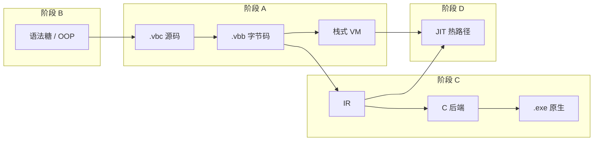

# Verbose-C 功能实现目标清单

本文档描述 **C 语言兼容之外** 的扩展能力与编译器演进目标，涵盖脚本化语法糖、面向对象、字节码产物、原生编译后端与 JIT。C 语言本体兼容项见 [C_COMPATIBILITY_TARGETS.md](./C_COMPATIBILITY_TARGETS.md)。

## 优化、编译与 JIT 主线实现路径

与优化、编译、JIT 相关的目标编号及推荐顺序（不含 P1-1～P1-7 语法糖/OOP、P2-6 数组切片）：

```
1.  F-P0-1  .vbb 格式与序列化          【已完成】稳定字节码产物
2.  F-P0-2  .vbb 直接加载执行          【已完成】跳过前端直接运行
3.  F-P0-3  O1 字节码级优化            【已完成】窥孔优化，语义不变
4.  F-P1-8  增量编译与依赖追踪         【已完成】源未变时复用 .vbb
5.  F-P2-1  IR 与控制流图              【未完成】多后端统一中间表示
6.  F-P2-2  O2/O3 优化等级             【未完成】AST/IR 层高级优化
7.  F-P2-3  AOT C 后端                 【未完成】emit-c / emit-exe 独立可执行文件
8.  F-P2-4  AOT 运行时 libvbcrt        【未完成】启动、堆、I/O、退出码
9.  F-P2-5  Native 机器码后端           【未完成】LLVM/汇编/对象文件
10. F-P3-2  热点识别与 JIT 报告         【未完成】统计热点，不生成机器码
11. F-P3-3  JIT 代码缓存与可执行内存    【未完成】trampoline 与代码页
12. F-P3-4  受限整数热循环 JIT MVP      【未完成】首版 JIT 执行
13. F-P3-5  去优化与调试               【未完成】guard 回退与错误栈
14. F-P3-6  OSR 栈上替换               【未完成】长循环中途切入 JIT，可选
```

跨文档前置：F-P1-8 依赖 C-P1-6；F-P2-3 依赖 C-P1-8；F-P2-4 依赖 C-P1-5；F-P3-5 依赖 C-P1-7。

---

## 1. 目标边界

- **总目标**：在现有「源码 → 字节码 → 栈式 VM 解释执行」管线基础上，逐步演进为可生成并执行原生二进制的完整编译器。
- **范围**：扩展语法、OOP 语义、字节码持久化与加载、字节码优化、中间表示（IR）、指令选择与寄存器分配、机器码生成、JIT。
- **非目标**（本清单不覆盖）：C17 标准库完整实现、预处理器与 C 类型系统细节（见 C 兼容清单）、IDE/LSP 集成。
- **与 C 兼容清单的关系**：本清单**不重复** C 兼容文档已列项（如显式 `int main()` / `void main()` 的识别、自动调用与退出码通路，见 [C_COMPATIBILITY_TARGETS.md § P1-8](./C_COMPATIBILITY_TARGETS.md)）。两者并行时，入口策略需统一：**有 `main` 定义 → C 兼容 P1-8；无 `main` 定义 → 本文 P1-1 脚本入口语义**。

## 2. 优先级定义

- **P0（必须）**：不完成则无法支撑「解释器 → 编译器」主路径的下一阶段（字节码产物闭环、后端输入稳定）。
- **P1（高优）**：显著影响扩展语言体验或后端开发效率，但不阻断字节码/AOT 最小闭环。
- **P2（增强）**：性能、多目标、高级 OOP/语法糖；建议在 P0/P1 主干稳定后推进。
- **P3（远期）**：JIT、动态去优化、跨平台发布体系等研究型或工程量大项。

---

## 3. P0 目标（必须完成）

### P0-1 字节码二进制格式与序列化闭环

- 目标能力：
  - 【已完成】定义稳定的 `.vbb`（Verbose-C Bytecode）紧凑二进制格式：魔数、版本号、目标 ABI、常量池、函数表、类表、结构体表、模块级字节码、行号表、调试元数据（详见 [VBB_FORMAT.md](./VBB_FORMAT.md)）
  - 【已完成】常量池支持现有运行时对象的可序列化子集：`int`/`float`/`bool`/`string`/`null`、函数元数据、类元数据（方法字节码通过索引引用）、结构体布局；`VBCPointer`/`VBCInstance`/`VBCNativeFunction` 暂不支持
  - 【已完成】实现 `ArtifactStore.save_bytecode()` / `load_bytecode()`（`verbose_c/fs/artifact_store.py`）
  - 【已完成】实现 `artifact_path_for_source()`：由 `.vbc` 推导默认 `.vbb` 路径为 `<源目录>/__vbccache__/<stem>.vbb`，可与 `-o/--output` 配合
  - 【待完善】格式版本策略：版本不匹配、魔数错误、截断、section checksum/SHA 失败时抛出 `VBCBytecodeError`（含文件路径）；当前仅定义 version 1，不提供旧版 JSON 载荷或跨版本自动迁移
- 当前现状：
  - `ArtifactStore` 已实现紧凑二进制读写，section 化打包函数/类/常量池/字节码块/行号表/调试信息
  - 编译 `.vbc` 时始终写出 `.vbb`（`run_source_file()` 在编译成功后调用 `save_bytecode()`）
  - CLI 支持 `-o/--output` 指定产物路径；未指定时写入 `__vbccache__`
  - 回归测试：`tests/test_artifact_store.py`（round-trip、损坏文件、section 校验）、`tests/test_cli_bytecode.py`（默认缓存目录与 `-o` 输出）
- 验收标准：
  - 给定 `tests/grammar/functions_test.vbc`，编译后可写出 `.vbb`，再次加载后与内存编译结果字节码等价（逐指令比对或哈希一致）
  - 常量池中字符串、数值、函数引用在加载后可被 VM 正确还原
  - 格式版本不匹配时抛出 `VBCCompileError` 或专用 `VBCBytecodeError`，含文件路径与期望版本
  - 至少 2 类测试：正向（round-trip 编译-保存-加载-执行）、反向（损坏/截断文件、错误魔数）

### 【依赖 F-P0-1】P0-2 字节码文件直接读取与执行

- 目标能力：
  - 【已完成】CLI 支持直接运行 `.vbb`：输入文件后缀为 `.vbb` 时走字节码加载执行（无需 `--bytecode` 显式模式）
  - 【已完成】`engine` 层新增 `run_bytecode_file()`：跳过词法/语法/类型检查，直接构造 `VBCVirtualMachine` 并 `excute()`
  - 【待完善】加载路径与源码路径解耦：`.vbb` 内嵌 `source_path`，加载后若源文件仍存在则用于运行时错误回溯；尚无 `--source-map` 参数，无源码时仍可运行
  - 【已完成】`--compile-only` 与字节码输出打通：编译 `.vbc` 始终写出 `.vbb`；`--compile-only` 只控制是否执行，不控制是否生成产物
- 当前现状：
  - `run_source_file()` 编译成功后保存 `.vbb`，可选执行内存编译结果
  - `run_bytecode_file()` 通过 `ArtifactStore.load_bytecode()` 恢复字节码与常量池后执行
  - CLI 已支持 `-o/--output`、`.vbb` 输入分支；`.vbb` 输入不支持 `-o` 与 `--compile-only`
  - 回归测试：`tests/test_cli_bytecode.py` 覆盖 `.vbc → .vbb → 执行` 闭环
- 验收标准：
  - `verbose-c foo.vbb` 执行结果与 `verbose-c foo.vbc` 一致（同一源码 freshly 编译对比）
  - `--compile-only -o foo.vbb foo.vbc` 生成文件后，单独执行 `.vbb` 成功
  - 运行时错误仍能输出 PC、操作码名；若行号表存在，应映射回合理行号
  - 反向：加载非 `.vbb` 或版本不兼容文件时失败并报错

### P0-3 字节码级优化（解释器后端第一步）

- 目标能力：
  - 【已完成】定义优化等级：`O0` 保持现有行为；`O1` 启用不改变语义的字节码级优化
  - 【已完成】在 `Compiler.compile()` 代码生成之后增加可选 **字节码优化 Pass**（`optimize_level > 0` 时启用）
  - 【已完成】实现基础窥孔优化：删除 `NOP`、删除不可达指令、删除无意义跳转、合并跳转链
  - 【已完成】优化后更新 `lineno_table` 与跳转目标，保证 VM 行为和错误定位不变
  - 【已完成】CLI 支持 `-O0` / `-O1`，并可通过 `--dump optimize` 输出优化后字节码；暂不提供 `--optimize`
- 当前现状：
  - `Compiler.__init__` 接受 `optimize_level`，CLI 与 engine 已传递到模块、函数、方法和构造函数编译
  - `verbose_c/compiler/bytecode_optimizer.py` 提供独立 O1 字节码优化 Pass
  - 标签解析在 `OpcodeGenerator.resolve_labels()` 中统一完成，优化器模块只处理已解析的整数 PC 目标
- 验收标准：
  - `optimize_level=0` 与优化前行为 bitwise 一致（现有测试全部通过）
  - `optimize_level=1` 对含无意义跳转、不可达指令或 `NOP` 的样例可减少指令条数，执行结果不变
  - dump `optimize` 可查看优化后的指令序列，且行号表仍能映射到合理源码行；dump `opcode` 保持原字节码视图
  - 每类字节码优化至少有 1 个正向用例和 1 个保持语义不变的回归用例

---

## 4. P1 目标（高优先级）

### 【依赖 C-P1-5】【依赖 C-P1-8】P1-1 脚本化语法糖：隐式 `main` 入口（无显式 `main` 定义时）

- 目标能力：
  - 【部分完成】入口文件**未定义** `int main()` / `void main()` 时，将可执行顶层代码视为运行在隐式 `main` 内；语义上等价于编译器合成：

    ```c
    int main() {
        // 入口文件中所有顶层可执行语句（含全局变量声明与初始化）
        // 函数/类定义仅完成注册，不自动执行
        return 0;   // 这里虽然写了return，但想表达的实际上是类似于C语言中main的return，也就是将执行结果返回给命令行，实际return应该必须在函数中使用，这里不带返回功能，类似exit(0)
    }
    ```

  - 【未完成】顶层（函数体外）出现 `return` / `return expr;` **必须报编译错误**；`return` 仅用于从函数返回，脚本隐式入口不提供顶层 `return` 语法糖
  - 【部分完成】典型脚本式入口：`tests/stdio_test.vbc` 无 `main`，顶层 `write`/`read` 直接执行即属此模式
  - 【未完成】隐式入口正常结束时，编译器在可执行顶层代码末尾自动注入 `exit(0)`，进程退出码为 `0`（需 `cli` / `engine` / VM 退出码通路闭环）
  - 【未完成】内置函数 `exit(int code)`：在隐式或显式 `main` 内调用可立即终止进程并返回指定退出码（**暂未实现**）
  - 【明确不在此项】显式 `main` 定义时的自动调用、返回值、与顶层语句的执行顺序 — 见 C 兼容 **P1-8**，本文不重复
- 当前现状：
  - 解释器已支持「无 `main` 则顶层顺序执行」，行为接近脚本模式，但**未形式化**为隐式 `main`，也无统一退出码约定
  - `OpcodeGenerator.visit_ModuleNode` 平铺执行模块语句，无入口模式标记
  - 无 `exit()` 内置函数；CLI 不读取 VM 退出码
- 与 C 兼容 P1-8 的分工：

| 条件 | 负责文档 | 行为概要 |
| ---- | -------- | -------- |
| 存在 `int main()` / `void main()` 定义 | C 兼容 P1-8 | 顶层注册 + 自动调用 `main`；`int main` 的 `return` 为退出码 |
| **不存在** `main` 定义 | **本文 P1-1** | 可执行顶层代码等价于隐式 `main` 体；末尾自动 `exit(0)`；`exit(code)` 可提前终止；顶层 `return` 非法 |

- 验收标准：
  - `tests/stdio_test.vbc` 在无修改下可编译运行，I/O 行为与现在一致，正常结束后 shell 退出码为 `0`
  - 隐式入口文件中 `exit(3);` 实现后，进程以退出码 `3` 结束（不必执行到末尾自动注入的 `exit(0)`）
  - 同一文件**不能**既无 `main` 定义又期望 C 兼容 P1-8 的自动 `main` 行为；一旦定义 `main`，仅 P1-8 生效
  - 反向：隐式入口模式下，顶层 `return;` 或 `return expr;` 必须编译失败，并提示 `return` 只能出现在函数内

### P1-2 脚本化语法糖：范围表达式 `Range`

- 目标能力：
  - 【未完成】语法层支持范围字面量或表达式（如 `0..10`、`0..10..2`，具体语法待 grammar 定义）
  - 【未完成】`RangeNode` 接入 parser 与 type checker；定义 `RangeType` 或复用迭代协议
  - 【未完成】`OpcodeGenerator.visit_RangeNode` 实现：生成范围对象或降维为 `for` 循环 desugar
  - 【未完成】`for (int i : range)` 或 `for (i = 0; i < n; i++)` 糖化形式（二选一 MVP）
- 当前现状：
  - AST 已有 `RangeNode`（`verbose_c/parser/parser/ast/node.py`），但 **grammar 未接入**
  - `visit_RangeNode` 直接 `NotImplementedError`
- 验收标准：
  - 范围参与 `for` 循环可正确迭代
  - 步长默认值、空范围、倒序范围（若支持）有明确语义与测试
  - 反向：非法范围表达式报类型或语法错误

### P1-3 脚本化语法糖：关键字参数

- 目标能力：
  - 【未完成】函数定义可选关键字参数：`FunctionNode.kwargs` 从 AST 占位接入 grammar
  - 【未完成】调用语法：`foo(a=1, b=2)`；`CallNode.kwargs` 参与类型检查与代码生成
  - 【未完成】构造函数 `new Foo(x=1)` 支持关键字参数
  - 【未完成】与位置参数混用规则：位置在前、关键字在后；重复参数报错
- 当前现状：
  - `CallNode` / `FunctionNode` 已有 `kwargs` 字段，标注 `# TODO 暂未使用`
  - `visit_CallNode` / `visit_NewInstanceNode` 遇 `kwargs` 即 `NotImplementedError`
- 验收标准：
  - 内置函数与用户自定义函数均可用关键字调用
  - 缺省参数、仅关键字调用场景通过
  - 反向：未知参数名、重复绑定、位置参数在关键字之后 — 编译错误

### 【依赖 C-P1-5】【依赖 C-P1-8】P1-4 脚本化语法糖：内置类型与反射增强

- 目标能力：
  - 【部分完成】`true`/`false`/`null` 字面量；`string` 类型
  - 【未完成】`exit(int code)` 内置函数（进程终止与退出码，与 **P1-1** 联调）
  - 【待完善】字符串与数值互操作规则文档化（隐式转换边界与 C 模式切换策略）
  - 【未完成】可选：字符串插值或格式化糖（如 `"%d".format(x)` 或 f-string 风格，语法待定）
- 当前现状：
  - 隐式转换在 `TypeChecker` 与 `OpcodeGenerator._emit_implicit_cast_if_needed` 中部分实现
  - `visit_CastNode` 注释 `# TODO 增加自定义数据类型和类的转换`
- 验收标准：
  - 新糖引入时不破坏现有 `expressions_test.vbc` 等行为

### P1-5 面向对象：核心模型巩固

- 目标能力：
  - 【已完成】`class` 定义、多继承 `extends A, B`、`new`、`成员访问`（`.`）、方法调用
  - 【已完成】`super` 方法调用（`super.get_id()`）；`SUPER_GET` 操作码
  - 【已完成】字段默认 `null`、显式初始化、`__init__` 自动生成（无用户定义时）
  - 【已完成】MRO 计算（`ClassType._compute_mro`）、父类字段/方法合并
  - 【待完善】`super` 语义仅绑定第一个父类（`visit_SuperNode` 取 `super_class[0]`），多继承下需明确规则
  - 【未完成】显式 `this` 关键字（当前方法内隐式 `this` 为局部槽 0）
- 当前现状：
  - `tests/grammar/classes_and_members_test.vbc` 覆盖基本类场景
  - 类对象在编译期写入常量池为 `VBCClass`，方法为 `VBCFunction`
- 验收标准：
  - 多继承方法解析符合 MRO 顺序（钻石继承基础场景有测试）
  - `super` 在多层继承链上调用正确父类实现
  - 反向：类重复定义、继承未定义类、在非方法内使用 `super` 报错

### 【依赖 F-P1-5】P1-6 面向对象：访问控制与静态成员

- 目标能力：
  - 【未完成】`public` / `private`（或 `protected`）修饰类字段与方法
  - 【未完成】`static` 字段与 `static` 方法：属于类而非实例
  - 【未完成】语义层禁止类外访问 `private` 成员；同一类/友元规则（MVP 可仅做类内+同类实例）
- 当前现状：
  - 所有成员均为公开；无修饰符 grammar
- 验收标准：
  - 类外访问 `private` 字段/方法编译失败
  - `static` 方法可通过 `ClassName.method()` 调用，无需实例
  - 静态与实例成员 shadowing 规则有测试

### 【依赖 F-P1-5】P1-7 面向对象：构造、析构与类型转换

- 目标能力：
  - 【部分完成】用户定义 `__init__` 与用户字段初始化语句合并进合成构造逻辑
  - 【未完成】父类 `__init__` 链式调用（`super.__init__(...)` 或自动默认）
  - 【未完成】析构函数 `__del__` 或 `~ClassName()` 与 GC 协作（确定性与 GC 触发时机需文档化）
  - 【未完成】类实例向上/向下转型（`TypeChecker` 规则 7 待实现）、与 `CastNode` 打通
- 当前现状：
  - `type_checker_visitor`：`# TODO 规则 7: 允许对象类型之间的向上和向下转型`
- 验收标准：
  - 子类实例可赋给父类类型变量（向上转型）
  - 向下转型失败时运行时或编译期报错（策略需明确）
  - 构造链在多层继承下字段初始化顺序正确

### 【依赖 C-P1-6】【依赖 F-P0-1】【依赖 F-P0-2】P1-8 增量编译与依赖追踪

- 目标能力：
  - 【已完成】实现 `IncrementalCompiler`（`verbose_c/fs/incremental_compile.py`），定位为**依赖感知的入口翻译单元缓存复用**，而非 include 文件级独立编译
  - 【已完成】记录入口 `.vbc` 在预处理阶段实际读入的 `#include` 依赖文件，包含暂定头文件 `.inc` 以及被直接 include 的 `.vbc`
  - 【已完成】源文件、任一 include 依赖、编译参数或编译器/字节码格式版本变更时，`needs_recompile()` 为真，并重新编译整个入口翻译单元
  - 【已完成】未变更时跳过 tokenize / preprocess / parse / type check / codegen，直接复用入口文件对应的 `.vbb`
  - 【已完成】与 `.vbb` 产物存在性和内容哈希联动，MVP 使用 SHA-256 内容哈希，不依赖文件时间戳
  - 【已完成】依赖图持久化为侧车 `<artifact_path>.deps.json`；未修改 `.vbb` 二进制格式
- 当前现状：
  - `IncrementalCompiler` 已支持 manifest 写入、SHA-256 校验、缓存失效判断、依赖读取与 `invalidate(path)`
  - 当前编译流程在 `Preprocessor.process_tokens()` 中递归展开 `#include` 并拼接为单一 token 流，后续 parser/compiler 只处理入口翻译单元整体
  - `Preprocessor.dependencies` 已暴露“本次实际依赖文件集合”，仅记录生效条件分支中成功读入的 include 文件
  - `.vbc` 被 include 时与 `.inc` 一样参与预处理拼接，不产生独立模块产物，也不单独缓存编译结果
  - `run_source_file()` 默认启用增量缓存；命中时直接加载入口 `.vbb`，未命中时重新编译并刷新侧车依赖清单
- 验收标准：
  - 【已完成】修改入口文件、被 include 的 `.inc` 或被 include 的 `.vbc` 后，再次编译入口文件会触发整个入口翻译单元重编译
  - 【已完成】未变更时跳过完整前端编译，直接加载入口文件对应的 `.vbb`（与 P0-2 联调）
  - 【已完成】依赖侧车文件记录入口路径、产物路径、编译参数、依赖文件列表与每个文件的内容哈希
  - 【已完成】`invalidate(path)` 可使指定入口或依赖相关的缓存失效；依赖文件失效时，引用它的入口产物也会失效
  - 【已完成】增量缓存命中与未命中两条路径的执行结果和退出码与 freshly compile 保持一致

---

## 5. P2 目标（增强项：优化与 AOT 编译）

> 后端管线目标形态：**typed AST / 字节码 → CFG / IR → 优化 → C 后端或 native 后端 → 可执行文件**。首个 AOT 闭环建议优先选择 `emit-c`，避免过早绑定手写机器码和平台 ABI。

### P2-1 中间表示（IR）与控制流图

- 目标能力：
  - 【未完成】定义适合作为多后端输入的 IR，至少包含基本块、控制流边、临时变量、局部变量、调用、内存读写和类型信息
  - 【未完成】支持从 typed AST 或现有 stack bytecode 生成 IR；MVP 可先覆盖整数、布尔、局部变量、函数、`if`、`while`、`for`
  - 【未完成】IR 保留源码行号或调试映射
  - 【未完成】支持 `--dump ir` 输出文本形式 IR，便于教学和回归对比
- 当前现状：
  - 无 IR 模块；`CompilerPass` 仅有 `TYPE_CHECK`、`GENERATE_CODE`
  - 后端输入目前是栈式字节码和 Python 运行时对象
- 验收标准：
  - 简单算术函数、条件分支和循环可生成结构正确的 IR
  - IR dump 可对照源码行号，并能明确显示基本块和跳转关系
  - 遇到尚不支持的 AST 节点或 opcode 时，编译器给出明确错误，而不是生成错误 IR

### 【依赖 F-P0-3】【依赖 F-P2-1】P2-2 O2/O3 优化等级

- 目标能力：
  - 【未完成】`O2` 支持 typed AST 或 IR 层局部优化：常量折叠、死分支消除、简单代数化简
  - 【未完成】`O3` 支持 IR / CFG 层优化：常量传播、死代码消除、局部公共子表达式消除、简单循环优化
  - 【未完成】优化等级与 P0-3 分工明确：`O1` 只做字节码局部优化，`O2/O3` 才做跨基本块或语义级优化
- 当前现状：
  - 仅保留 `optimize_level` 参数，未实现任何优化等级
- 验收标准：
  - `O0`、`O1`、`O2`、`O3` 对同一程序的执行结果一致
  - 常量表达式、死分支、简单循环样例在优化后 IR 或字节码规模下降
  - 有副作用表达式不被错误折叠或删除

### 【依赖 C-P1-8】【依赖 F-P2-1】P2-3 AOT C 后端（第一版独立二进制路径）

- 目标能力：
  - 【未完成】支持 `--emit-c`：将受限 IR 或受限字节码生成 C 源码
  - 【未完成】支持 `--emit-exe` 或 `--target=native`：调用系统 C 编译器生成独立可执行文件
  - 【未完成】MVP 支持整数、布尔、局部变量、全局变量、函数调用、`if`、`while`、`for`、基础数组
  - 【未完成】不支持的语言能力（如类、GC 对象、复杂指针、动态内置函数）在 AOT 模式下明确报错
- 当前现状：
  - 无 AOT 后端；`.vbc` 只能编译为内存字节码并由 Python VM 执行
- 验收标准：
  - `hello world`、整数运算、条件分支、循环、函数调用样例可生成 C，并可编译为独立可执行文件
  - 生成程序的 stdout、stderr 和退出码与 VM 解释执行一致
  - AOT 模式遇到不支持特性时失败信息包含特性名称和源码位置

### 【依赖 C-P1-5】【依赖 F-P2-3】P2-4 AOT 运行时（libvbcrt MVP）

- 目标能力：
  - 【未完成】定义 AOT 程序所需的最小运行时：启动入口、退出码、基础堆分配、数组存储、内置 I/O 函数
  - 【未完成】明确 Python VM 对象模型与 AOT 运行时对象模型的兼容边界
  - 【未完成】后续支持字符串、结构体、指针和可选 GC 安全点
- 当前现状：
  - 运行时对象、内存管理、GC 和内置函数主要位于 Python `verbose_c/vm`、`verbose_c/object`
- 验收标准：
  - AOT 程序可调用最小内置函数并正确返回退出码
  - AOT 运行时和 VM 对同一受支持子集表现一致
  - 文档说明 AOT 暂不支持的运行时能力

### 【依赖 F-P2-1】【依赖 F-P2-3】【依赖 F-P2-4】P2-5 Native 机器码后端（C 后端之后）

- 目标能力：
  - 【未完成】在 AOT C 后端稳定后，选择 native 后端路线：LLVM/llvmlite、汇编文本、对象文件或手写机器码
  - 【未完成】支持目标平台描述、调用约定、指令选择和寄存器分配
  - 【未完成】生成 `.asm`、`.obj` / `.o` 或机器码 blob，并可链接为可执行文件
- 当前现状：
  - 未开始；当前项目无目标后端目录，也无寄存器或 ABI 抽象
- 验收标准：
  - 不含 OOP/GC 的纯整数函数可生成 native 代码并正确运行
  - 寄存器分配结果可 dump，便于教学验证
  - native 后端与 `emit-c` 后端在受支持子集上结果一致

### 【依赖 C-P0-7】P2-6 数组切片语法糖（Python 风格 `[start:end:step]`）

> 依赖 C 兼容 [P0-7](./C_COMPATIBILITY_TARGETS.md) 数组闭环；与 C17 标准下标 `arr[i]` 并存，**冲突时以 C17 语义为准**。

- 目标边界：
  - 仅当 `[` `]` 内出现 `:` 时启用切片语法；纯表达式下标 `arr[i]`、`arr[i + j]` 始终走 C17 路径
  - 不修改 C17 数组类型、衰变、初始化等既有语义
  - 切片为 Verbose-C 扩展，合法 C17 源码不应因本特性产生行为变化
- 目标能力：
  - 【未完成】支持 `arr[start:end]`、`arr[start:end:step]` 及省略界形式（如 `arr[:]`、`arr[::2]`）
  - 【未完成】`start` / `end` / `step` 均为可选整型表达式；负索引语义文档化（若支持）
  - 【未完成】切片结果类型与存储策略明确（MVP 可返回新数组副本，视图语义为后续增强）
- 当前现状：
  - 【未完成】未开始；C 数组（P0-7）尚未实现
- 与 C17 的冲突处理原则：

| 场景 | C17 语义 | 本扩展 |
| ---- | -------- | ------ |
| `arr[i]` | 下标访问 | **同左**，不启用切片 |
| `arr[1:3]` | 非法语法 | 切片（扩展） |
| `arr[i:j]`（`i`,`j` 为变量） | 非法 | 切片（扩展） |
| 多维 `m[i][j]` | 嵌套下标 | **同左**；多维切片 `[i:j]` 为后续可选 |

- 验收标准：
  - `int a[10];` 已实现时，`a[2:5]`、`a[::2]` 可编译运行且结果符合文档
  - `a[0]`、`a[i + 1]` 与 C17 行为一致，回归用例在开启切片特性前后结果不变
  - 反向：`step = 0`、对非数组切片、切片界类型错误 — 编译失败并给出明确中文错误

---

## 6. P3 目标（远期：JIT 即时编译）

### P3-1 分层编译策略

- 目标能力：
  - 【已完成】定义 **Tier 0**：字节码解释（现有 VM）
  - 【未完成】定义 **Tier 1**：热点函数或热点循环 JIT 至机器码（baseline compiler，快速生成）
  - 【未完成】定义 **Tier 2**（可选）：优化 JIT，复用 IR 优化和 native 后端能力
  - 【未完成】支持解释器回退：JIT 不支持或守卫失败时回到字节码解释执行
- 当前现状：
  - 仅 Tier 0；`VBCVirtualMachine` 主循环解释执行
- 验收标准：
  - 可配置阈值，超过后受支持函数或循环执行路径切换为 JIT
  - JIT 关闭、JIT 开启、JIT 回退三种模式的执行结果一致

### 【依赖 F-P3-1】P3-2 热点识别与 JIT 报告

- 目标能力：
  - 【未完成】统计函数调用次数、PC 命中次数和循环回边次数
  - 【未完成】支持 `--jit-report` 或 dump 输出热点函数、热点 PC、回边信息
  - 【未完成】JIT 阈值可配置，且默认不改变现有解释执行行为
- 当前现状：
  - VM 执行日志可记录 PC 和操作码，但没有热点计数与报告
- 验收标准：
  - 循环样例能稳定报告回边热点
  - 函数调用样例能稳定报告热点函数
  - 开启热点报告不改变程序输出和退出码

### 【依赖 F-P3-1】P3-3 JIT 代码缓存与可执行内存

- 目标能力：
  - 【未完成】按平台分配 RWX/RX 内存页（Windows `VirtualAlloc` 等）
  - 【未完成】JIT 桩（trampoline）：解释器 `CALL_FUNCTION` 可跳转到 JIT 入口
  - 【未完成】代码缓存失效：源码/字节码变更时丢弃旧 JIT 块
- 当前现状：
  - 未开始
- 验收标准：
  - 同一函数第二次热调用走 JIT 路径，结果正确
  - 内存泄漏检测：反复 JIT/失效不无限增长（压力测试）

### 【依赖 F-P2-1】【依赖 F-P3-2】【依赖 F-P3-3】P3-4 受限整数热循环 JIT MVP

- 目标能力：
  - 【未完成】第一版 JIT 只支持整数算术、比较、局部变量、简单 `while` / `for` 循环
  - 【未完成】暂不支持函数内联、复杂指针、结构体、类、GC 对象和 I/O 内联
  - 【未完成】遇到不支持的指令或类型时自动回退解释器
- 当前现状：
  - 未开始
- 验收标准：
  - 大量整数循环样例在 JIT 开启时结果与解释器一致
  - 不支持特性不会错误执行，必须解释执行或给出明确诊断
  - 可通过日志确认某段热循环实际进入 JIT

### 【依赖 C-P1-7】【依赖 F-P3-4】P3-5 去优化与调试

- 目标能力：
  - 【未完成】守卫（guard）：类型假设失败时去优化
  - 【未完成】JIT 帧与 `TracebackFrame` 衔接，错误栈可混合显示 JIT/解释帧
  - 【未完成】`--jit=off|baseline|opt` CLI 开关
- 当前现状：
  - 未开始
- 验收标准：
  - 故意触发类型去优化后程序仍正确
  - 运行时错误栈可读

### 【依赖 F-P3-4】【依赖 F-P3-5】P3-6 OSR（栈上替换，可选）

- 目标能力：
  - 【未完成】长循环中途进入 JIT（On-Stack Replacement）
- 当前现状：
  - 未开始
- 验收标准：
  - 大循环场景相对纯解释有可测加速（基准脚本，不强制具体倍率）

---

## 7. 明确降级（暂不进入本清单主线）

- 完整 C++ 风格模板、异常 `try/catch`、协程
- 多线程/memory model
- 跨平台 AOT（ARM、macOS、Linux）在 x64 Windows MVP 之前
- 手写 x86-64 机器码作为首个 AOT 后端（优先完成 `emit-c` 和 IR 闭环）
- 嵌入式/WASM 目标
- 数组切片 `[start:end:step]`（见 **P2-6**；依赖 C 兼容 P0-7，非 C17 本体）

---

## 8. 主线目标关系（非实现步骤）

- 字节码主线：**P0-1 `.vbb` 格式**、**P0-2 `.vbb` 直接执行**、**P0-3 `O1` 字节码优化**共同构成解释器后端闭环
- 优化主线：**P0-3 `O1`** 是局部字节码优化；**P2-2 `O2/O3`** 是 typed AST / IR 优化；两者验收时均必须保持 VM 行为一致
- AOT 主线：**P2-1 IR**、**P2-3 AOT C 后端**、**P2-4 AOT 运行时**共同构成第一版独立二进制能力
- Native 主线：**P2-5 Native 机器码后端**在 AOT C 后端稳定后推进，可选择 LLVM/llvmlite、汇编文本或对象文件路线
- JIT 主线：**P3-2 热点识别**、**P3-4 受限整数热循环 JIT MVP**、**P3-5 去优化与调试**共同构成第一版 JIT 能力
- 扩展语法主线：**P1-1** 至 **P1-7** 与 C 兼容清单并行；**P2-6** 数组切片依赖 C 兼容数组闭环

### 依赖关系示意



---

## 9. 统一验收原则

- 每个目标至少包含：
  - **语法层**（若适用）：grammar / AST 可解析
  - **语义层**：类型检查、作用域、约束正确
  - **代码生成层**：字节码、IR 或机器码符合规范
  - **运行时验证**：执行结果正确
- 每项至少 2 类测试：
  - 正向样例（应通过）
  - 反向样例（应报错或定义明确行为）
- 字节码格式或 ABI 变更必须 bump 版本号并更新 round-trip 测试
- 错误信息应包含：文件、行号（或 IR/PC）、核心原因

---

## 10. 完成判定（Definition of Done）

一个目标项可标记「完成」，必须同时满足：

- 相关管线层级已闭环（例如 P0 项需 **序列化 + 加载 + VM 执行** 全通）
- 有对应回归测试用例（`tests/` 下正向 + 反向）
- 若影响用户可见行为，更新 README 或语法说明（不要求重复 C 兼容文档内容）
- 不引入现有解释执行能力回退
- 入口与退出码：显式 `main` 以 C 兼容 P1-8 为准；无 `main` 以本文 P1-1 为准；两者实现后不得互相覆盖或冲突

---

## 11. 当前基线快照（2026-07-08）

| 能力域 | 状态 | 关键模块 |
| ------ | ---- | -------- |
| 栈式字节码 VM | 【已完成】 | `verbose_c/vm/core.py`、`Opcode` |
| 源码 → 字节码编译 | 【已完成】 | `Compiler`、`OpcodeGenerator` |
| 字节码文件 `.vbb` 序列化/加载 | 【已完成】 | `verbose_c/fs/artifact_store.py`、[VBB_FORMAT.md](./VBB_FORMAT.md) |
| `.vbb` 直接执行 | 【已完成】 | `run_bytecode_file()`、`cli.py` |
| 类 / 继承 / new / super | 【部分完成】 | `opcode_generator_visitor`、`VBCClass` |
| 隐式 `main` 脚本入口（无 `main` 定义） | 【部分完成】 | 顶层顺序执行已有，未形式化/无 `exit` |
| 显式 `main` 自动调用与退出码 | 【见 C 兼容 P1-8】 | 不在本文重复 |
| Range / 关键字参数 | 【未实现】 | AST 占位，generator 抛 `NotImplementedError` |
| 数组切片 `[start:end:step]` | 【未实现，见 P2-6】 | 依赖 C 兼容 P0-7 |
| `exit()` 内置函数 | 【未实现】 | — |
| 增量编译 | 【已完成】 | `IncrementalCompiler`、`Preprocessor.dependencies`、`run_source_file()` |
| 字节码优化 | 【已实现】 | `-O1` 启用 O1 字节码优化 |
| IR / 机器码 / AOT | 【未实现】 | 无后端目录 |
| JIT | 【未实现】 | 无 |
